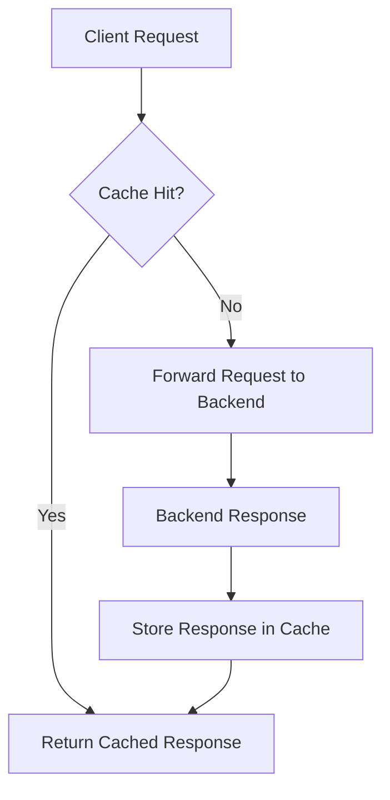
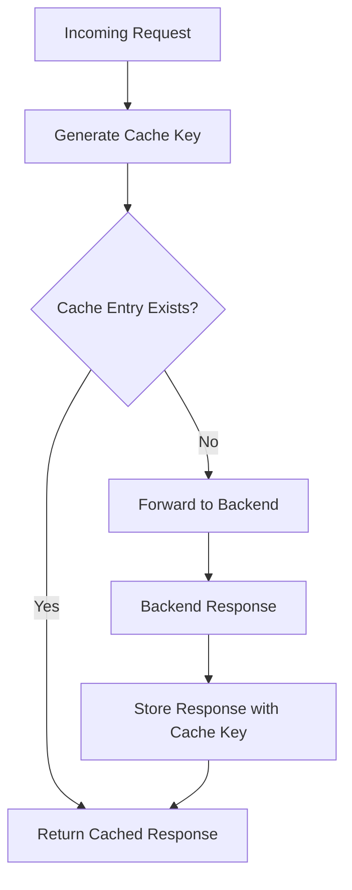

# API Gateway Caching – Technical Revision Notes

## Overview

* **API Gateway Caching** helps reduce cost and improve performance by storing responses for a defined period.
* Instead of forwarding every request to the backend, API Gateway can serve cached results directly.

---

## Key Concepts

* **Cache**: Temporary storage of API responses in API Gateway.
* **TTL (Time-to-Live)**: Duration for which the cached response is considered valid. Once expired, the cache is
  refreshed by calling the backend again.
* **Stage-level setting**: Caching is enabled per **API Gateway stage**.

---

## Benefits

1. **Cost Savings**

    * Reduces the number of backend requests.
    * Less compute and network usage → lower operational costs.

2. **Performance Improvements**

    * Faster responses since results are served from cache.
    * Lower latency improves API consumer experience.

3. **Reduced Backend Load**

    * Frees backend resources for other operations.
    * Useful when certain endpoints are called frequently with the same parameters.

---

## How It Works

1. Client makes a request to an API endpoint.
2. API Gateway checks if the response is available in the cache and valid (TTL not expired).
3. If cached → API Gateway returns the cached response immediately.
4. If not cached/expired → API Gateway forwards the request to the backend, stores the response in cache, and then
   returns it to the client.

---

## Diagram

---

## Best Practices

* Use caching for **read-heavy** and **frequently repeated requests**.
* Choose an appropriate **TTL** based on how often data changes.
* Avoid caching for endpoints that return **highly dynamic or personalized data**.
* Monitor cache usage to balance between **freshness** and **performance**.

---

Do you want me to also cover **cache key configurations** (e.g., controlling which request parameters form the cache
key)? That’s often asked in interviews when discussing API Gateway caching.

# API Gateway Caching – Technical Revision Notes (Extended with Cache Keys)

## Overview

* **API Gateway Caching** reduces cost and latency by storing responses for a configured **TTL (Time-to-Live)**.
* Responses can be served directly from cache instead of hitting the backend service.

---

## Cache Key Configuration

### What is a Cache Key?

* A **cache key** is the unique identifier used by API Gateway to determine whether a cached response exists for a
  request.
* By default, API Gateway uses the **request path** and **query string parameters** to build the cache key.

### Cache Key Sources

* **Path Parameters**
  Example: `/users/{id}` – each `id` results in a separate cache entry.
* **Query String Parameters**
  Example: `/products?category=books` vs `/products?category=toys` → two different cache keys.
* **Request Headers**
  Specific headers can be included/excluded from cache key consideration.
* **Authorization Context Variables**
  Useful when API responses depend on identity-related data (e.g., user role).

---

## Example

* API: `/weather?city=London`
* **Cache key** = `{path=/weather, query=city=London}`
* If the next request is `/weather?city=Paris`, it generates a **new cache key** and bypasses the cached London
  response.

---

## Benefits of Custom Cache Keys

* **Precision Control**: Cache responses only for relevant parameters, ignoring noisy headers or query strings.
* **Reduced Cache Fragmentation**: Avoids creating too many unique cache entries (e.g., by excluding session IDs or
  timestamps).
* **Consistency**: Ensures clients with equivalent requests map to the same cached result.

---

## Diagram: Cache Key Usage

---

## Best Practices for Cache Keys

* **Include only meaningful parameters** that affect the response.
* **Exclude volatile parameters** (e.g., timestamps, request IDs).
* **Be mindful with Authorization headers** – caching user-specific responses may lead to **data leaks**.
* **Set TTL appropriately** per endpoint to balance data freshness with cost savings.

---

✅ With cache keys, you can fine-tune **when caching is beneficial** (e.g., `/products?category=electronics`) vs **when
it should be avoided** (e.g., `/cart?userId=123`).

---

Would you like me to also add notes on **invalidating/refreshing the API Gateway cache** (manual flush vs TTL expiry)?
That’s another interview-relevant area.

