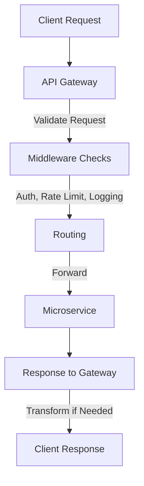

# API Gateway – Interview Revision Notes

## Evolution of API Gateway

* **2000s: Monoliths**

    * Single server/monolith handled all features.
    * Client → Single URL → Monolith → Database.
    * **Simple architecture**, easy to reason about.

* **2010–2012: Microservices emerge**

    * Monoliths split into **multiple microservices**.
    * Problem: Clients had to know URLs of all services or rely on one service to forward requests.
    * Both approaches were **clumsy**:

        * Hardcoding URLs → client complexity.
        * Forwarding through one service → redeployment needed for routing changes.

* **2013–2014: First-gen API Gateways**

    * Introduced a **thin layer** in front of microservices.
    * Client only needs **one endpoint** (gateway).
    * Gateway handles **routing** to the correct microservice.

* **Mid-2010s to Now**

    * API Gateways also consolidate **shared middleware**:

        * **Authentication**
        * **Rate limiting**
        * **Logging & metrics**
        * **TLS termination**
        * **Caching** common responses
    * Result:

        * Services focus on **business logic**.
        * Clients only know **one URL**.
        * Gateway provides **guardrails** for the whole platform.

---

## Core Responsibilities of an API Gateway

1. **Request Validation**

    * Check formatting, headers, body.
    * Reject invalid requests early.

2. **Middleware Execution**

    * Apply common concerns:

        * Authentication (OAuth token verification).
        * Rate limiting (e.g., check Redis).
        * Metrics/logging.
    * May call **external services**.
    * Needs to be fast (executed on every request).

3. **Routing**

    * Use a **routing map/config** to send requests to the right service.
    * Example: `/messages → messaging service`.
    * Routing is the **primary responsibility**.

4. **Response Transformation**

    * Convert backend protocol to client-friendly format.
    * Example: gRPC/RPC response → REST JSON response.

---

## Simplified Flow

---

## Examples of API Gateways

* **Managed Cloud Solutions**

    * AWS: **API Gateway**
    * Azure: **API Management**
    * GCP: **Apigee / API Gateway**

* **Open Source**

    * **Kong**
    * **Tyk**
    * **Express Gateway**

---

## Key Takeaways for Interviews

* **Always include an API Gateway** in system design diagrams for microservices.
* State its role briefly:

    * **Routing** + **Middleware (auth, rate limiting, logging, caching, TLS termination)**.
* Do **not spend too much time** on it.

    * It’s an **expectation** in microservice architecture.
    * Interviewers want focus on business-critical design parts.

---

Would you like me to also create a **condensed one-page cheat sheet** (with just keywords, responsibilities, and
examples) for last-minute interview review?
