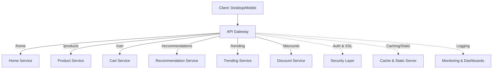

# API Gateway – Key Concepts and Features

## Use Case: E-commerce Application

* **URLs**:

    * `/home`: Returns static **HTML** and **JS** files.
    * `/products`: Returns product list in **JSON** format.
    * `/cart`: Requires user to be **logged in** to view/add items.
    * Admin-only URLs (e.g., add/delete product) require **authorization**.

* **Client Devices**: Requests can come from **desktop** or **mobile**.

* **Security Requirements**:

    * Use **HTTPS** with **SSL certificates**.
    * **Rotate SSL certificates** every 30–60 days (best practice).

---

## What is an API Gateway?

* **Definition**: An **entry point** for all API requests.
* **Purpose**: Separates **cross-cutting concerns** (security, auth, routing, logging) from business logic.

---

## Core Features of API Gateway

### 1. Cross-Cutting Concerns

* **Authentication**: Ensures users are logged in for protected APIs (e.g., cart).
* **Authorization**: Validates user roles (e.g., admin for product changes).
* **SSL/TLS Termination**: Handles **HTTPS** and certificate rotation.
* Protects APIs from **bad actors**.

---

### 2. Routing

* **Monolith to Microservices**:

    * `/home` → Microservice 1.
    * `/products` → Microservice 2.
* Centralized routing via API Gateway ensures:

    * Requests are sent to the correct **microservice**.
    * Simplified client interaction (clients only talk to gateway).

---

### 3. Response Handling

* **Request Aggregation**:

    * Instead of multiple client calls (recommendations, trending products, discounts), client makes **1 call**.
    * API Gateway **calls all services**, aggregates responses, and returns **single response**.
* **Static Content**: Gateway can directly serve static files (removes need for static-serving microservice).
* **Caching**:

    * Frequently requested responses (e.g., trending products recalculated hourly) can be cached in gateway.
    * Reduces load on backend microservices.

---

### 4. Advanced Routing

* **Device-based Routing**:

    * Mobile → Low-quality video service (fast).
    * Desktop → High-quality video service (slower).
* **Load Balancing**:

    * Round-robin distribution across service copies.
* **Canary Releases / A/B Testing**:

    * Route small % of traffic (e.g., 5%) to new version.
    * Route majority to stable version.

---

### 5. Protocol Handling

* Supports **protocol translation**:

    * Converts **HTTP/2** or **WebSocket** requests to older **HTTP/1.1** if backend services don’t support them.
* Enables adoption of new protocols without modifying services.

---

### 6. Monitoring and Logging

* Centralized **request/response logging**.
* Metrics:

    * **Latency**
    * **Request counts**
    * **Error rates**
* Built-in **dashboards** for performance monitoring.

---

### 7. API Monetization

* Example: **Payment Service**

    * A reliable payment microservice can be exposed via API Gateway.
    * Published in **API marketplace** (e.g., AWS API Gateway).
    * Clients are **charged per API call**.

---

## Common API Gateway Implementations

* **On-Prem / VM**:

    * **Apache**
    * **Nginx**
    * **Spring Cloud Gateway**
* **Cloud-Managed Services**:

    * **AWS API Gateway**
    * **Azure API Management**
    * **Google Cloud Endpoints**

---

## High-Level Architecture

---

## Key Takeaways

* **API Gateway = Entry point + Guard + Aggregator + Router**.
* Handles **auth, SSL, routing, caching, load balancing, monitoring** centrally.
* Simplifies client communication in **microservices architecture**.
* Provides flexibility for **protocols**, **traffic shaping**, and **monetization**.

---

Do you want me to also create a **comparison table of API Gateway vs Load Balancer vs Service Mesh** for your interview
prep?

Great idea 👍 — here’s a **comparison table** that clearly distinguishes **API Gateway**, **Load Balancer**, and *
*Service Mesh**. Perfect for interviews where they test if you understand *where each fits in the architecture*.

---

# API Gateway vs Load Balancer vs Service Mesh

| Feature / Aspect             | **API Gateway**                                                                                                                                                                                 | **Load Balancer**                                                                                                                 | **Service Mesh**                                                                                                                                                                                    |
|------------------------------|-------------------------------------------------------------------------------------------------------------------------------------------------------------------------------------------------|-----------------------------------------------------------------------------------------------------------------------------------|-----------------------------------------------------------------------------------------------------------------------------------------------------------------------------------------------------|
| **Primary Role**             | Entry point for **external clients**; handles cross-cutting concerns (auth, SSL, routing, caching).                                                                                             | Distributes **incoming traffic** across multiple server/service instances.                                                        | Manages **service-to-service (east-west) communication** inside microservices architecture.                                                                                                         |
| **Traffic Direction**        | **North-South** (Client → Server).                                                                                                                                                              | Both North-South and limited **East-West**.                                                                                       | **East-West** (Service A ↔ Service B).                                                                                                                                                              |
| **Key Functions**            | - **Authentication & Authorization** - **Protocol translation** (HTTP/2 ↔ HTTP/1.1) - **Request aggregation** - **Response caching** - **Monitoring/Logging** - **Monetization** | - **Load distribution** (round-robin, least connections, IP hash, etc.) - **High availability** - **Failover handling**     | - **Service discovery** - **Traffic management** (circuit breaking, retries, timeouts) - **Security** (mTLS between services) - **Observability** (tracing, metrics, logs)                 |
| **Examples**                 | AWS API Gateway, Kong, Nginx, Spring Cloud Gateway, Apigee                                                                                                                                      | AWS ELB/ALB/NLB, HAProxy, Nginx, F5                                                                                               | Istio, Linkerd, Consul, AWS App Mesh                                                                                                                                                                |
| **Use Cases**                | - Single entry point for **clients**. - Protect APIs from unauthorized users. - Aggregate multiple services into **1 response**. - Expose APIs for **external monetization**.          | - Scale horizontally by distributing load. - Ensure **fault tolerance**. - Maintain service **availability** during spikes. | - Manage complex **microservice communication**. - Enforce **policies** (rate limits, retries). - Secure service-to-service calls with **mTLS**. - Enable **observability** at mesh level. |
| **Granularity**              | Works at **API level** (specific endpoints).                                                                                                                                                    | Works at **network level** (distributes TCP/HTTP traffic).                                                                        | Works at **service level** (fine-grained control between microservices).                                                                                                                            |
| **Protocol Handling**        | Can translate protocols (HTTP ↔ WebSocket).                                                                                                                                                     | Limited to supported protocols (HTTP, TCP, UDP).                                                                                  | Supports multiple protocols, usually focused on **HTTP/gRPC**.                                                                                                                                      |
| **Position in Architecture** | At the **edge** (between external clients and backend).                                                                                                                                         | Sits between **clients and service instances** (or between layers of services).                                                   | Inside the **cluster** (between services, often with sidecar proxies).                                                                                                                              |

---

## Quick Analogy

* **API Gateway** = *Reception desk* of a company → verifies identity, decides where to send you, enforces rules.
* **Load Balancer** = *Traffic cop* → evenly directs cars (requests) to multiple lanes (instances).
* **Service Mesh** = *Internal office manager* → manages how employees (services) talk to each other, ensures security
  and efficiency.

---

👉 For interviews:

* Stress **API Gateway = external entry point**.
* **Load Balancer = distributes load, ensures availability**.
* **Service Mesh = manages internal service-to-service communication**.

---

Do you also want me to create a **Mermaid diagram** showing where each (Gateway, Load Balancer, Service Mesh) sits in a
typical microservices architecture?
