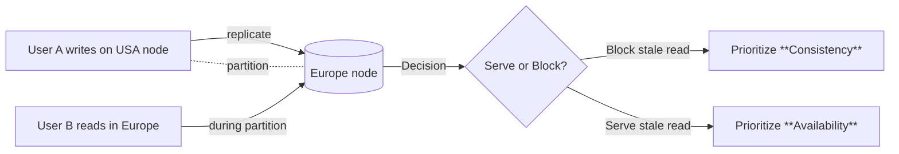

# CAP Theorem — What to Say in System Design Interviews

## TL;DR (Interview Posture)

* **Always surface CAP early** under **non-functional requirements**.
* In a distributed system, **partition tolerance** is a given → your trade-off is **Consistency (C)** vs *
  *Availability (A)**.
* Ask: **“If different users briefly see different states, is that catastrophic?”**

    * **Yes → prioritize *strong consistency*.**
    * **No → prioritize *availability* (accept *eventual consistency*).**

---

## Core Definitions (Keep These Handy)

* **CAP Theorem**: In a distributed system you can guarantee only **two of three**: **Consistency (C)**, *
  *Availability (A)**, **Partition Tolerance (P)**.
* **Distributed System**: Multiple nodes communicating over a network (assume partitions can happen).
* **Consistency (Strong)**: **All users see the same data at the same time**; reads reflect the most recent write.
* **Availability**: **Every request gets a response** (success or failure) even during failures.
* **Partition Tolerance**: **System continues working despite network failures** between nodes (e.g., links severed or
  delayed).

> In interviews, because P is mandatory in distributed systems, the **real choice is C vs A**.

---

## Why CAP Matters in Interviews

* You must **align on non-functional requirements** before deep diving the design.
* Picking **C or A** **shapes** choices around storage, replication, failure handling, and client UX (spinners, errors,
  stale views).

---

## The Partition Scenario (Anchor Example)

Two datacenter servers: **USA** and **Europe**.

* **Normal path**: User A updates profile on **USA** → data replicates to **Europe** → User B reads latest profile.
* **Partition occurs before replication**: Link breaks between USA ↔ Europe.

**System decision when User B reads:**

* **Option A (Consistency)**: **Stop serving** the stale read (return error/blocked read) → **prioritize strong
  consistency**.
* **Option B (Availability)**: **Serve stale data** (old profile) until healed → **prioritize availability**.

### Visual: Network Split and the Choice

---

## When to Choose **Consistency**

Catastrophic consequences if users see divergent states:

* **Ticketing / Seat Booking** (**no double booking**): showing seat “6A” as available in one region when already taken
  in another is unacceptable.
* **Inventory at last units** (e.g., **Amazon**): two buyers think they purchased the same **last item**.
* **Financial systems / Order books**: reads must reflect **latest trades/orders** to avoid incorrect pricing/decisions.

**Design implications when you pick Consistency:**

* **Distributed transactions** (e.g., keep **cache** and **DB** atomically aligned).
* Potentially **limit to a single primary node/instance** for writes to avoid propagation races.
* **Higher perceived latency** is acceptable (e.g., spinners while waiting for propagation).
* **Tooling/choices** mentioned: **Relational DBMS** (e.g., **Postgres/SQL**), **Google Spanner**; some **NoSQL** can
  run in **strong consistency** modes (e.g., **DynamoDB** with strong reads).

---

## When to Choose **Availability**

Temporary staleness is **not catastrophic**; user experience prefers uptime:

* **Profiles / Social content**: late post/update visibility is okay.
* **Business listings (e.g., Yelp)**: an **out-of-date menu** for a brief period is tolerable.
* **Catalog/Metadata (e.g., Netflix descriptions)**: eventual visibility is fine.

**Design implications when you pick Availability:**

* **Scale out with multiple replicas**; accept **replication lag**.
* **Eventual consistency** patterns are fine; **CDC** (Change Data Capture) fits naturally.
* **Technologies**: **DynamoDB** (multi-AZ setups without strong read requirement), **Cassandra**, and similar
  HA-optimized stacks.

---

## Nuanced, Real-World Mix (Subsystem-level Choices)

You can **prioritize differently per subsystem**:

* **Ticketing platform (e.g., Ticketmaster)**

    * **Consistency** for **booking seats** (no double booking).
    * **Availability** for **CRUD on events/search** (event descriptions can be eventually consistent).

* **Tinder**

    * **Consistency** for **matching** (a swipe should immediately reflect a **match** if the counterpart already
      swiped).
    * **Availability** for **viewing/updating profiles** (old photo/bio for a short time is fine).

---

## Consistency Levels (Show Senior Nuance)

Beyond “strong vs eventual,” know these gradations:

* **Strong Consistency** (**all reads see latest write**): what people usually mean by “consistency” in CAP discussions.
* **Causal Consistency**: **related events appear in order** (e.g., a **reply** never appears **before** the **comment**
  it replies to).
* **Read-Your-Writes Consistency**: a user **immediately sees their own updates** (others may see stale data).
* **Eventual Consistency**: replicas **converge** to the same state **over time**; acceptable for non-critical
  freshness.

---

## Step-by-Step: CAP in the Interview

1. **Clarify requirements**

    * Functional: features, actors, workloads.
    * **Non-functional**: latency, throughput, durability, **CAP stance**.
2. **State the CAP decision**

    * “This is a distributed system; we assume partitions. I’ll **prioritize *Consistency*** / ***Availability***
      because **\<reason tied to impact>**.”
3. **Explain failure behavior**

    * If **Consistency**: describe **blocking/errored reads** during partitions.
    * If **Availability**: describe **stale-read windows** and **healing** behavior.
4. **Map to design choices**

    * Storage (single writer, quorum, replication), caches (coherent vs lazy), transactions, CDC, client UX.
5. **Add nuance**

    * Call out **subsystems** with different **C/A** priorities and **consistency levels** where relevant.
6. **Acknowledge trade-offs**

    * Latency, throughput, complexity, operator burden, user experience.

---

## Trade-Off Cheat Sheet

* **Choose Consistency when**: Double-spends, double-booking, price/position correctness, legal/financial correctness.
* **Choose Availability when**: Read-mostly UX, feed/timeline/profile metadata, search/browse experiences.
* **Operational Impacts**:

    * **Consistency**: more coordination, possible **higher latency**, strict write paths, careful cache invalidation,
      potential single-primary patterns.
    * **Availability**: simpler failover for reads, **stale tolerance**, reconcile/repair flows (read repair, background
      healing).

---

## Interview Snippets You Can Say (No Code)

* “Given partitions are inevitable, we must choose between **C** and **A**. Because **\<risk>** is catastrophic, I’ll *
  *prioritize strong consistency** and accept **higher latency** and **blocked reads** during partitions.”
* “For **match events** I need **strong consistency**; for **profile reads** I can accept **eventual consistency**—I’ll
  isolate them with separate services and replication policies.”
* “Users should **read their own writes** immediately; broader audience can converge **eventually**.”

---

## Key Terms to Bold (for quick recall)

* **CAP Theorem**, **Consistency**, **Availability**, **Partition Tolerance**, **Strong Consistency**, **Eventual
  Consistency**, **Causal Consistency**, **Read-Your-Writes**, **Distributed Transactions**, **Replication Lag**, *
  *CDC (Change Data Capture)**, **Primary/Single Node**, **Read Replica**, **Quorum** (if you bring it up), *
  *Propagation**, **Stale Read**.

---

## Open Questions to Park (If Interviewer Wants Depth)

* Required **freshness SLAs** (how stale is acceptable, and for how long)?
* **Client semantics** during partitions (error vs degraded mode)?
* **Reconciliation** strategy post-partition (read repair, replays, conflict resolution)?

Use this structure to keep the CAP discussion crisp, justified, and connected to concrete design decisions.

## More videos

