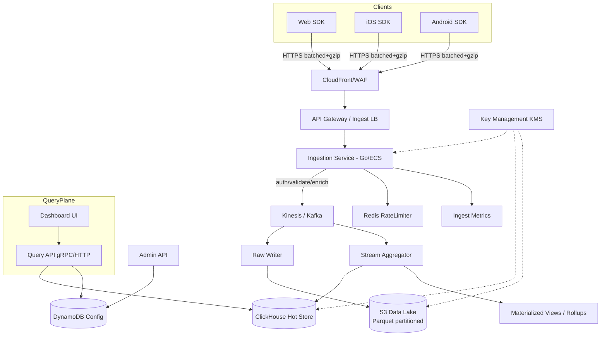

# HLD: Client-Side Metrics Capture Service

One-stop pipeline to collect, ingest, store, and query client (web/mobile/desktop) telemetry and UX metrics at scale
with minimal SDK overhead.

### Functional requirements

* SDKs for Web (JS), Android, iOS to capture events, page views, performance (LCP/TTFB/FID), errors, custom metrics.
* Batch & compress events on device; retry with backoff; offline queue.
* Auth via per-app API key; tenant isolation (multi-org).
* Ingestion API (HTTPS) accepting batches; lightweight ack.
* Near-real-time aggregation (minute/hour); raw storage for replay.
* Query APIs for time-series (count, percentile, group-by), funnels, and error rates.
* Basic governance: schema versioning, PII redaction, sampling, rate limiting.
* Admin APIs: create org/app, rotate keys.
* Observability: metrics, logs, traces for the pipeline itself.

### Non functional requirements

* Availability ≥ 99.9% ingestion; graceful degradation (store-and-forward).
* Ingestion p95 latency ≤ 150 ms; end-to-end “event visible” ≤ 60 s.
* Horizontal scalability to 10–20k events/sec peak.
* Durable storage ≥ 30 days (raw), ≥ 13 months (aggregates).
* Cost-efficient cold storage; hot queries under \~2–5 s for 95th percentile.
* Security: TLS 1.2+, keys scoped to app, at-rest encryption, WAF.
* Compliance guardrails: PII hashing on device, TTL/delete by userId hash.

### Assumption taken

* Runs on AWS; services in 2 AZs minimum.
* Consumers mostly need aggregations (not per-event low-latency reads).
* No hard real-time guarantees; ≤ 60 s freshness is acceptable.
* Average event size \~0.3–0.8 KB after gzip; clients support gzip/deflate.

### System Limitation

* Client clock skew can affect timestamps (SDK adds server-receive time).
* Offline devices may drop data beyond local queue limits.
* Extremely high-cardinality labels (e.g., userId as label) can hurt query perf; enforced caps.
* SDKs provide “best effort” PII redaction; ultimate responsibility on integrator.

### Entities

* **Org**(orgId, name, plan, createdAt)
* **App**(appId, orgId, platform, apiKey, status, samplingRate)
* **MetricEvent (raw)**(orgId, appId, sessionId, eventTs, recvTs, name, value, unit, attrs(json), device, sdkVersion,
  ipHash, userAnonId)
* **AggregateBucket**(orgId, appId, metric, windowStart, granularity, count, sum, min, max, p50, p95, p99, dims(json))
* **APIKey**(keyId, appId, createdAt, lastRotatedAt, status)

### High level design diagram

### Throughput and Latency calculations

* **Scale target (MVP):** 1M DAU × 100 events/day ≈ **100M events/day**
  Avg EPS = 100,000,000 / 86,400 ≈ **1,157 events/s**; peak (×10) ≈ **11.6k EPS**.
* **Ingress bandwidth:** 0.5 KB/event (avg gzip) → peak ≈ 11.6k × 0.5 KB ≈ **5.8 MB/s**.
* **Storage/day (compressed):** 100M × 0.5 KB ≈ **50 GB/day** raw; Parquet columnar \~0.5× again → \~**25–35 GB/day**
  effective.
* **Compute:**

    * Ingestion: Go services \~5–10k RPS per small cluster behind NLB/APIGW; autoscale by CPU/RPS.
    * Aggregator: 1 shard per \~5k EPS; start with 3–4 shards (HA).
* **Latency budgets:**

    * Client → 202 response: network (50 ms) + LB (20 ms) + ingest (40 ms) ≈ **≤110 ms p95**.
    * Stream → hot store visible: stream lag ≤ 10 s + flush ≤ 10 s → **≤20–30 s** typical, **≤60 s** SLO.

### API's

**Protocols:** Ingestion over HTTPS (REST); internal services gRPC; queries REST+gRPC.

* `POST /v1/ingest/batch` (REST)
  Headers: `X-API-Key`, `Content-Encoding: gzip`
  Body: `{ sdk, appId, sentAt, events: [ { ts, name, value?, unit?, attrs{}, sessionId, userAnonId, device{} } ] }`
  Returns: `202 Accepted { accepted, rejected, nextRetryAfterMs? }`

* `POST /v1/admin/apps` (REST, admin)
  Create app & API key; rotate: `POST /v1/admin/apps/{appId}/keys:rotate`

* `POST /v1/query/timeseries` (REST/gRPC)
  Body: `{ orgId, appId, metric, from, to, granularity, filters[], groupBy[] , agg: [count|sum|p95|p99] }`

* `POST /v1/query/funnel` (REST)
  Body: `{ steps: [ "page_view", "signup", "purchase" ], windowSec, filters[] }`

* `GET /v1/healthz` (REST) – readiness/liveness.

### Data Flow

#### API 1 – Ingest Batch (`POST /v1/ingest/batch`)

1. SDK batches N events (e.g., 50), gzips payload, attaches API key, retries on 5xx with jitter.
2. WAF/CloudFront filters & blocks abusive IPs; forwards to API Gateway/NLB.
3. Ingestion Service:

    * AuthN: validate API key → resolve appId/orgId from **Config (DynamoDB)**.
    * Guardrails: payload size ≤ 512 KB; per-key RPS & byte rate checked via **Redis**.
    * Validation & enrichment: coerce schema, attach recvTs, ipHash, SDK/server version, drop disallowed attrs.
    * Sampling (if configured) and dynamic backpressure (429 with `nextRetryAfterMs`).
    * Write to **Kinesis/Kafka** partitioned by `(orgId, appId)`.
4. Respond `202 Accepted` immediately after enqueue.
5. **Raw Writer** consumes stream → writes hourly Parquet to **S3** with schema evolution.
6. **Aggregator** consumes stream → updates minute/hour rollups & quantile sketches → flush to **ClickHouse**.

#### API 2 – Time-Series Query (`POST /v1/query/timeseries`)

1. Caller provides org/app, metric, time range, filters, and aggregations.
2. Query API authorizes (org scope) and pushes a gRPC query to CH.
3. CH reads materialized views (minute buckets); applies group-by & quantiles.
4. Results streamed back to client/UI; optional CSV export triggers async job to read from S3 for large ranges.

---

**MVP Notes (what to build first):**

* Web SDK + `POST /v1/ingest/batch` + Go ingestion + Kinesis + ClickHouse aggregates + S3 raw writer + one `timeseries`
  query.
* Essential guardrails: payload cap, API key auth, basic WAF rules, Redis rate limit.
* One dashboard: events/sec, page load p50/p95, JS errors by release, simple filters (country, version).

**Operational guardrails:**

* Dead-letter topic for validation failures; replay tool from S3 → stream.
* Key rotation with dual-key grace window.
* Cardinality watchdog (top exploding labels) with automated drop policies.

If you want, I can tailor this to your existing stack (e.g., swap Kinesis/Kafka, ClickHouse →
OpenSearch/BigQuery/Timescale, or wire it into your Golang Echo services & Prometheus).
