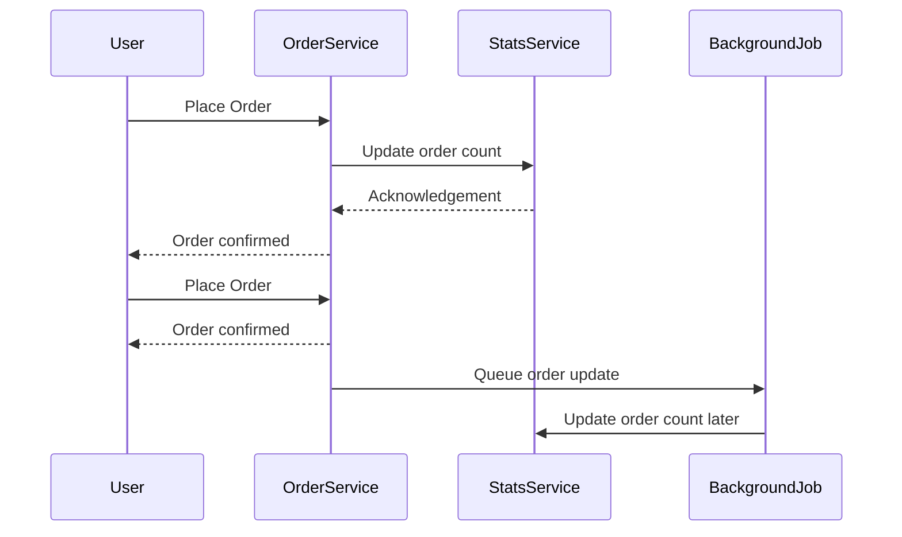

# Eventual Consistency in Distributed Systems

## Introduction

* **Consistency** has different meanings depending on context:

    * **ACID Consistency**: Database ensures correctness by enforcing **constraints**, **triggers**, and **cascading
      rules**.
    * **CAP Theorem Consistency**: In distributed systems, all nodes should reflect the same **data state**.
* This lesson focuses on **consistency in distributed systems**, specifically **strong consistency** vs. **eventual
  consistency**.

---

## Distributed Systems

* A **distributed system**: multiple independent systems working together as one.
* Examples:

    * **Food application**:

        * **Order service** (places orders).
        * **Payment service**.
        * **Account service**.
        * **Loyalty service**.
        * **Stats service** (generates reports, e.g., number of orders).
    * **Databases** with replicated nodes for scalability and availability.

---

## Consistency in Distributed Systems

* Consistency ensures that data across all services/nodes is **synchronized and correct**.
* Example:

    * A user places 5 orders → **Stats API** should always return **5 orders**.

---

## Strong Consistency

* Achieved by **synchronous updates**:

    1. User places an order.
    2. **Order Service** creates the order.
    3. Order Service **calls Stats Service** to update count.
    4. Only after update completes → Response sent to user.
* **Guarantee**: Data is never inconsistent.
* **Problem**: If Stats Service has **complex logic or delays**, user waits longer.

---

## The Consistency Problem

* Synchronous updates hurt **performance** and **user experience**.
* Orders are created slower because system waits for all services to sync.

---

## Eventual Consistency

* Solution: **Asynchronous updates**.

    1. User places an order.
    2. Order Service **immediately confirms order** to user.
    3. A **background process** (e.g., **cron job** or **message queue**) updates Stats Service later.
* **Behavior**:

    * Temporary **inconsistency** exists.
    * Eventually, all systems reflect the same data.

---

## Summary of Concepts

* **Distributed System**: State split across multiple services/nodes.
* **Consistency**: Keeping state aligned across nodes.
* **Strong Consistency**: Data is **always consistent**, but can cause performance bottlenecks.
* **Eventual Consistency**: Data may be **temporarily inconsistent**, but will converge to consistency.

---

## Visualizing Strong vs. Eventual Consistency

---

✅ **Key Interview Takeaways**:

* Strong consistency = synchronous, reliable, but slower.
* Eventual consistency = asynchronous, faster, but temporary inconsistency.
* Trade-off depends on system requirements (**performance vs correctness immediacy**).

---

Do you want me to also include **real-world examples** (like Amazon shopping cart or DNS systems) to make these notes
stronger for interview prep?
