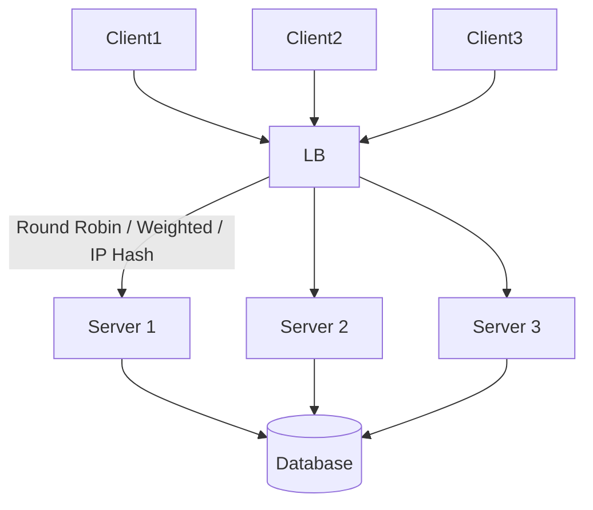

# Load Balancer – System Design Basics and Strategies

## Introduction

* A **load balancer** acts like a **traffic cop** in front of servers, distributing client requests evenly.
* Purpose:

    * **Increase capacity** → handle more concurrent users.
    * **Maximize throughput** → better utilization of all servers.
    * **Minimize latency** → prevent overload and failures.
* Often described as a **reverse proxy**, since it sits between clients and servers.

---

## Scaling Approaches

* **Vertical Scaling**

    * Increase server power (CPU, RAM, etc.).
    * Limited growth, single point of failure.

* **Horizontal Scaling**

    * Add more servers to handle requests.
    * Capacity scales linearly (e.g., 3 servers ≈ 3× load capacity).
    * Requires even load distribution → handled by a **load balancer**.

---

## Load Balancer Basics

* Clients send requests to the **load balancer**, not directly to servers.
* The load balancer redirects requests **in a balanced manner**.
* Benefits:

    * Supports horizontal scaling seamlessly.
    * Improves **system throughput** and **response time**.
    * Can be placed between:

        * Client ↔ Server
        * Server ↔ Database
        * Server ↔ Other servers
        * DNS ↔ Website

---

## Example: DNS Load Balancing

* When you type `google.com`:

    * A **DNS query** returns an IP address of a Google server.
    * DNS load balancer distributes client queries across multiple IPs.
* Demonstrated with `nslookup google.com`:

    * Two different terminals return different IPs.
    * Both IPs respond with valid Google pages.

---

## Types of Load Balancers

* **Hardware Load Balancer**

    * Physical devices, high cost, less flexible.

* **Software Load Balancer**

    * Cheaper, customizable.
    * Popular options: Nginx, HAProxy, Envoy, etc.

---

## Server Registration

* When servers are **added/removed**, they must **register/deregister** with the load balancer.
* Ensures traffic is only routed to **active, healthy servers**.

---

## Server Selection Strategies

### 1. Random Selection

* Picks servers randomly.
* Risk: Some servers may get overloaded.

### 2. Round Robin

* Requests are distributed **sequentially in a loop** across servers.
* Ensures even distribution.

### 3. Weighted Round Robin

* Assigns **weights** to servers.
* More powerful servers handle more requests.
* Example: Server S2 gets double requests compared to S1 and S3.

### 4. Least Connections / Health-Based

* Load balancer monitors:

    * Server response time.
    * Current resource utilization.
* Routes traffic to the **least busy or fastest** server.

### 5. IP Hashing

* Client IP → hashed → mapped to a server.
* Guarantees **client stickiness** (same client always goes to same server).
* Useful when **caching** is involved:

    * First request processed + cached.
    * Subsequent requests → cache hits (no recomputation).

---

## Advanced Setup

* Systems may use **multiple load balancers** for redundancy and performance.
* Different **strategies** can be combined depending on the workload.

---

## Visual Diagram

---

## Key Takeaways

* **Load balancer = reverse proxy** that improves scalability and fault tolerance.
* Supports **horizontal scaling** by distributing traffic fairly.
* Strategies include **round robin, weighted, least connections, and IP hashing**.
* Used across layers: **DNS, application, and database tier**.
* Critical for **high availability** and **performance optimization**.

---

Do you want me to also prepare a **comparison table** (pros/cons) of the server selection strategies for quick interview
revision?
