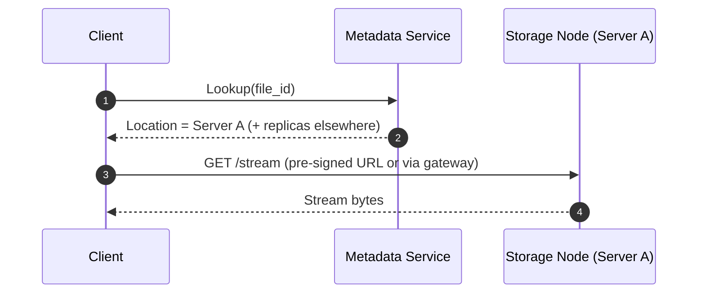
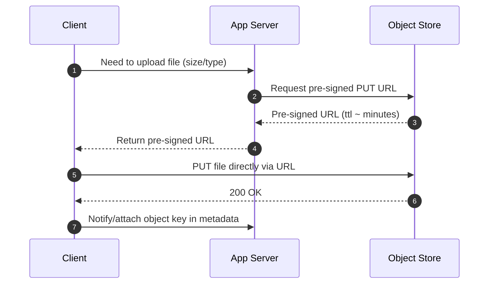

# Object Storage — Why It Exists & How To Use It (Interview Prep)

## TL;DR

* Store **large, mostly static files** (e.g., **videos**, **photos**, **audio**, **JSON**, **large text**) in **object
  storage**; keep **metadata** (IDs, owners, URLs, etc.) in a **relational/OLTP database**.
* Access files **directly** via **pre-signed URLs**; avoid proxying large payloads through your app servers.
* For big uploads, use **multipart (multi-part) upload**: **chunk**, **upload**, **stitch**.

---

## What Is Object Storage?

* Not a traditional DB, but you can **think of it as a database for large files (“*****blobs*****”)**.
* Files are just **byte sequences** (often megabytes+), persisted on **cheap storage nodes** (disks in racks/servers).
* Examples: **Amazon S3**, **Google Cloud Storage**, **Azure Blob Storage** (all support **pre-signed URLs** and *
  *multipart upload**).

**Keywords:** **object storage**, **blob**, **OLTP**, **relational database**, **pre-signed URL**, **multipart upload**,
**replication**, **erasure coding**, **11 nines durability**.

---

## Why Not a “Normal” Database for Blobs?

* **Relational/OLTP databases** optimize for **small, frequently changing records** with **rich queries/joins**—not for
  large files.
* Example (Postgres): rows are packed into **8 KB pages**. A **4 MB image** spans **\~500 pages**:

  * **Simple queries** (e.g., “top 50 users”) now drag along **huge page sets**, causing **overhead**, **memory pressure
    **, and **slowdowns**.
  * **Replication**: every write replicates **large blobs** to **every replica**, causing **lag** and **bandwidth burn
    **.
  * **Backups/Restore**: nightly backups **bloat**; **restores** that should take minutes can take **hours**.

**Bottom line:** Traditional DBs **choke on blobs** in **performance** and **cost**; use **object storage** for the
files.

---

## How Object Storage Works (High-Level)

* Files live on **storage nodes**; a **metadata service** knows **where** each object is.
* **Read path (simplified):**

  1. **Client** asks **Metadata Service** for object **location** via an **index**.
  2. **Metadata** returns a **server** (there are usually **multiple replicas**).
  3. Client **streams** the file **directly** from a storage server (often via a **pre-signed URL** or gateway).

### Why It’s Cheap & Durable

* **Flat namespace**: files addressed by a **single string key** (the “folders” you see are **UI sugar**). **Direct
  lookups**, no tree traversal.
* **Immutable writes**: you **don’t modify bytes in place**—you **create new versions** or **overwrite**. Fewer
  locks/races → **simpler, faster, cheaper**.
* **Redundancy**: objects are **replicated** or **erasure-coded** across **servers/racks/regions**, targeting **“11
  nines” durability** (**99.999999999%**). Losing a node is **non-eventful**; background **healing** restores
  redundancy.

---

## What To Know For Interviews

### 1) Separate **Metadata** from **Blobs**

* Keep **post IDs**, **creators**, **text**, **created\_at**, and the **file URL** in your **DB**.
* Keep the **photo/video file** in **object storage**.
* Rationale: **fast queries** on metadata; **cheap, scalable** file storage.

**Keywords:** **metadata**, **URL**, **normalized schema**, **object key**.

### 2) Use **Pre-Signed URLs** for Direct I/O

* **Upload** flow: server requests a **pre-signed URL** from object storage → client **PUTs** the file **directly** to
  storage.
* **Download** flow: client **GETs** via (signed) URL **directly** from storage.
* Benefits: **no extra bandwidth** through app servers, **better scalability**, **handles large files**.

**Keywords:** **pre-signed URL**, **direct upload**, **bandwidth offload**, **TTL**.

### 3) Handle **Large Files** with **Multipart Upload**

* **Chunk** the file into **parts** (speaker mentions approx **\~5 MB** chunks).
* **Upload** parts (in **parallel** or **sequentially**).
* Object store **stitches** parts into the final object after all parts arrive.

**Keywords:** **multipart upload** (a.k.a. **multi-part upload**), **chunking**, **parallelism**, **stitching**.

---

## Common Use Cases

* **User-generated media**: **photos**, **videos** in social/messaging apps.
* **Collaboration tools**: users **upload files** (e.g., design files, docs).
* **Static assets**: **CSS**, **JavaScript** (often **fronted by a CDN**).
* **Logs**: application **log files/output**.
* **ML training data**: large **text** corpora for **LLMs**.

**Keywords:** **CDN**, **static assets**, **UGC**, **logs**, **training data**.

---

## Architecture & Workflow (Step-By-Step Summary)

1. **Client action** (upload/download/view).
2. **App server** handles **auth**, **metadata**, and **pre-signed URL** issuance (when needed).
3. **Client ↔ Object store** direct **data path** (upload/download/stream).
4. **DB** stores **metadata only** (object **key/URL**, ownership, ACL references).
5. **Object store** ensures **durability** (**replication/erasure coding**) and **healing**.

---

## Key Terms (Quick Reference)

* **Object/Blob**: The stored file (bytes) plus minimal metadata (key, size, etc.).
* **Object Key**: **Flat** string identifier for the object (path-like only for humans).
* **Metadata Service**: Index that **maps keys → storage locations**.
* **Pre-Signed URL**: **Time-limited** URL granting **temporary access** to perform an operation (**PUT/GET**).
* **Multipart Upload**: Uploading a file in **chunks**, then **reassembling** server-side.
* **Replication/Erasure Coding**: Multiple copies or parity-based distribution for **durability**.
* **11 Nines Durability**: Target durability of **99.999999999%** for stored objects.

---

## Do/Don’t Cheat Sheet

**Do**

* **Store blobs in object storage;** store **metadata in DB**.
* **Use pre-signed URLs** for **direct client uploads/downloads**.
* **Use multipart upload** for **large files**.
* **Front static assets** with a **CDN** (where applicable).

**Don’t**

* **Don’t** keep **large images/files** inside user rows.
* **Don’t** proxy large file traffic through your **app servers** unless absolutely necessary.
* **Don’t** rely on “folders” in object stores—treat them as **flat keys**.

---

## Pitfalls & Trade-Offs (to mention if asked)

* **Consistency of metadata vs. object**: ensure the **DB row** and **object** stay in sync (idempotency, retries,
  cleanup).
* **Access control**: manage **permissions** via **pre-signed URLs** and server-side checks.
* **Costs**: watch **egress**, **request costs**, and **storage class** choices.
* **Restore/Retention**: backups are different—rely on object store **durability** and **versioning**, not DB backups.

---

## Example Providers (Mentioned)

* **Amazon S3** (most common in interviews)
* **Google Cloud Storage**
* **Azure Blob Storage**

---

## Open Notes from the Talk

* Multipart **chunk size** was cited as **\~5 MB** (speaker’s recollection). Treat as **approximate** within the context
  of the discussion.
* “Folders” in S3/GCS/Azure are **UI sugar**; the backend resolves a **single string key**.

---

**Use this as a mental model in system design interviews:**
**DB for metadata, Object Store for bytes, direct client I/O with pre-signed URLs, multipart for big files, and
durability via replication/erasure coding.**
