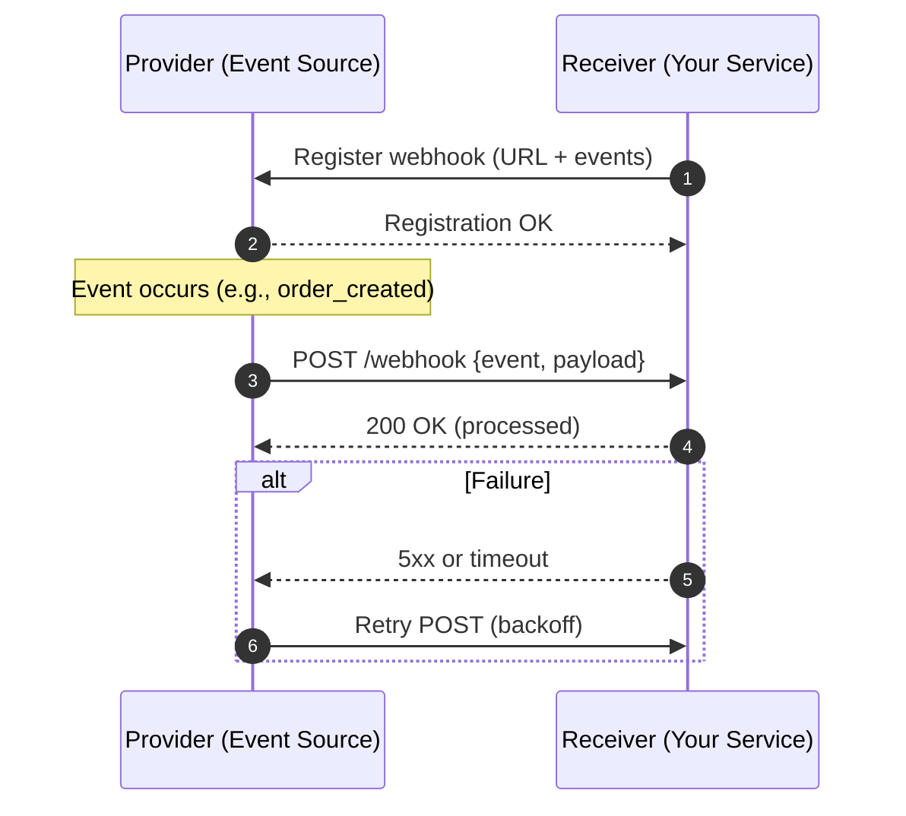

# Real-Time Communication on the Web: Polling, SSE, WebSocket, and Webhooks

## Overview

These notes summarize four **real-time communication** approaches used on the web: **HTTP Polling** (short & long), *
*Server-Sent Events (SSE)**, **WebSocket**, and **Webhooks**. Focus is on how they work, their **strengths/limitations
**, and **where to use them**. Diagrams use Mermaid for quick mental models.

---

## HTTP Polling

### Key ideas & terms

* **Short Polling** — client sends periodic **HTTP** requests at fixed intervals to check for new data; server responds
  immediately (even if empty).
* **Long Polling** — client sends a request the server **holds open** until **new data** is available or a **timeout**
  occurs; client immediately re-requests after response/timeout.
* **Near real-time** vs **real-time** — short polling is near real-time (gap between intervals); long polling provides
  real-time pushes over HTTP by delaying the response.

### How it works (step-by-step)

1. **Short Polling**

    * Client → Server: “Any updates?” every *N* seconds (e.g., **15s**).
    * Server: returns data if available, else **empty** response.
    * Client: processes data, waits for next interval.

2. **Long Polling**

    * Client sends request.
    * Server **keeps connection open** until data appears or **timeout** (e.g., **100s**).
    * On data or timeout, server responds; client **immediately re-issues** the request.

### Mermaid: Short vs Long Polling

```mermaid
sequenceDiagram
  autonumber
  participant C as Client (EventSource)
  participant S as Server
  C->>S: GET /stream (text/event-stream)
  S-->>C: event: update\ndata: ...
  S-->>C: event: update\ndata: ...
  Note over C,S: Connection stays open; server pushes whenever ready
  S-->>C: event: update\ndata: ...
```

### Advantages

* **Wide compatibility** (plain **HTTP**).
* **Easy implementation** (no special libraries).
* **Timeliness**: short polling = **near** real-time; long polling = **real-time** updates over HTTP.

### Limitations

* **Resource consumption**: short polling wastes bandwidth with many “empty” requests; long polling still repeats *
  *connections**.
* **Data delay**: short polling **miss window** between intervals.
* **Server load**: long-held connections under high concurrency can burden servers.

### Good use cases

* **User notifications / status badges** with **limited concurrency**.
* **Small data volumes** not requiring strict real-time (short polling).
* **Stricter real-time** without protocol change (long polling).

### Examples from the talk

* **Configuration / Feature Flag sync**: clients poll for latest settings; long polling for more immediate sync.
* **Social sharing backend**: async job submission via **Message Queue (MQ)**; frontend polls job **status** until *
  *success/failure**.

---

## Server-Sent Events (SSE)

### Key ideas & terms

* **SSE** — **HTTP-based server push**. Client opens a persistent connection; server **streams text events** to the
  client.
* **EventSource** — browser API to establish and auto-reconnect the SSE stream.
* **Unidirectional** — **server → client** only (no client → server via the same channel).

### How it works (step-by-step)

1. Client creates **EventSource** to a server endpoint.
2. Server accepts and **keeps connection open**.
3. When updates occur, server **pushes events** (as text).
4. If dropped, **automatic reconnection** by the client.

### Mermaid: SSE Push

```mermaid
sequenceDiagram
  autonumber
  participant C as Client (EventSource)
  participant S as Server
  C->>S: GET /stream (text/event-stream)
  S-->>C: event: update\ndata: ...
  S-->>C: event: update\ndata: ...
  Note over C,S: Connection stays open; server pushes whenever ready
  S-->>C: (more events over time)
```

### Advantages

* **Simplicity**: native **EventSource** in modern browsers.
* **Efficiency**: one persistent connection; reduced **HTTP overhead**.
* **Auto-reconnect**: built-in resilience.

### Limitations

* **Browser support**: older or certain mobile browsers may lack support.
* **Text-only**: **no binary** frames.
* **Unidirectional**: for **bidirectional** needs, consider **WebSocket**.

### Good use cases

* **Live news feeds**, **sports scores**, **market tickers** where data flows **server → client** continuously.

### Examples from the talk

* **Chat-style streaming responses**: server streams partial output **incrementally**.
* **Monitoring dashboards** (e.g., microservice metrics & circuit-breaking views) streaming real-time performance data.

---

## WebSocket

### Key ideas & terms

* **WebSocket** — **full-duplex**, **persistent** connection enabling **low-latency** two-way messaging.
* **HTTP Upgrade** — initial handshake via HTTP, then protocol switches to **WS/WSS**.
* **ws\:// / wss\://** — **WebSocket** and **secure WebSocket** schemes.

### How it works (step-by-step)

1. Client sends **HTTP Upgrade** request.
2. Server accepts and **upgrades** the protocol.
3. A **bidirectional** channel stays open until either side closes it.

### Mermaid: WebSocket Handshake & Chat

```mermaid
sequenceDiagram
  autonumber
  participant Mike as Client A
  participant S as Server
  participant Jane as Client B
  Mike->>S: HTTP Upgrade (to WebSocket)
  S-->>Mike: 101 Switching Protocols
  Jane->>S: HTTP Upgrade (to WebSocket)
  S-->>Jane: 101 Switching Protocols
  Note over Mike,S,Jane: Full-duplex channel established
  Mike->>S: "Hey Jane" (message)
  S-->>Jane: "Hey Jane"
  Jane->>S: "Hi Mike!"
  S-->>Mike: "Hi Mike!"
```

### Advantages

* **Low latency** due to persistent channel.
* **Full-duplex**: simultaneous send/receive improves **interactivity**.
* **Reduced server overhead** versus repeated HTTP requests.

### Limitations

* **Compatibility**: older systems may not support.
* **Security considerations**: long-lived sockets can increase **attack surface**.
* **Resource usage**: must manage connection lifecycles to avoid server exhaustion.

### Good use cases

* **Online gaming**, **real-time chat**, **financial trading UIs**, **live notifications** requiring **fast**, **two-way
  ** updates.

### Example from the talk

* **Real-time chat**: users join a room and exchange messages via the server over persistent sockets.

---

## Webhooks

### Key ideas & terms

* **Webhook** — **server-initiated** HTTP **POST** to a **subscriber’s URL** when an **event** occurs; truly *
  *event-driven**.
* **Subscription/Registration** — client (receiver) provides a **publicly reachable URL** and selects **events** of
  interest.
* **Retries** — sender typically retries on failures to avoid **event loss**.

### How it works (step-by-step)

1. Receiver registers a **target URL** and **event subscriptions**.
2. When an event occurs, sender **POSTs** payload (e.g., **JSON/XML**) to the URL.
3. Receiver processes the event and responds (e.g., **2xx**).
4. Sender may **retry** on non-success or timeout.

### Mermaid: Webhook Delivery



### Advantages

* **Real-time** notifications without polling.
* **Simpler architecture** for receivers (no periodic queries).
* **Easy to implement & maintain**.

### Limitations

* **Dependency on receiver availability**: need **retry** & **idempotency** to avoid losses/dupes.
* **Security**: must validate origin, use **signatures**, protect against **MITM**.
* **Capacity limits**: bursty events → ensure receiver can handle **high concurrency**.

### Good use cases

* **Automations** (trigger downstream jobs on content publish).
* **Third-party integrations** (e.g., payment status updates to merchants).
* **Monitoring alerts** (immediate system notifications).

### Example from the talk

* **E-commerce platform**: external systems subscribe to **order creation** events; platform pushes order data to
  subscribers’ URLs, reducing **wasteful polling** and **server load**.

---

## Choosing the Right Approach (Big-Picture Trade-offs)

* **Protocol & Direction**

    * **Polling** (HTTP request/response, **client-initiated**).
    * **SSE** (HTTP stream, **server→client** only).
    * **WebSocket** (**full-duplex**).
    * **Webhooks** (**server-initiated** HTTP POST to **your** endpoint).

* **Timeliness vs Complexity**

    * **Short Polling**: simplest; **near** real-time; inefficient at scale.
    * **Long Polling**: real-time over HTTP; more efficient than short polling but still connection-heavy.
    * **SSE**: simple, efficient **push** for **text** streams.
    * **WebSocket**: most interactive; best for **two-way** low-latency apps.
    * **Webhooks**: real-time **integration** across systems without persistent connections.

* **Scale & Concurrency**

    * High user counts with frequent updates: prefer **SSE**/**WebSocket** over **short polling**.
    * Cross-system events: **Webhooks** avoid consumers polling third-party APIs.

* **Security & Reliability**

    * **Webhooks**: authenticate/sign payloads; retries + idempotency.
    * **WebSocket/SSE**: manage **disconnects**, **reconnects**, and backpressure.
    * **Polling**: throttle intervals; enforce timeouts.

---

## Quick Glossary (bolded key terms)

* **HTTP Polling**: Client periodically requests updates; **short** (fixed interval), **long** (held connection until
  data/timeout).
* **SSE (Server-Sent Events)**: **HTTP** stream where server **pushes text events** to client using **EventSource**; *
  *one-way**.
* **EventSource**: Browser API for SSE with **auto-reconnect**.
* **WebSocket**: **Upgraded** connection (via **HTTP Upgrade**) enabling **full-duplex**, **low-latency** messaging (*
  *ws\://**, **wss\://**).
* **Webhook**: **Server-initiated** HTTP **POST** to a **subscriber URL** on **event**.
* **Timeout**: Maximum wait before a long-poll returns without data (e.g., **100s**).
* **Message Queue (MQ)**: Asynchronous component buffering jobs/events between services.
* **Real-time vs Near real-time**: Immediate delivery vs small interval-based delay.

---

## Patterns to Remember

* **Async jobs + polling UI** (social posting example): submit fast, process in background, **poll status**.
* **Streaming UX** with **SSE**: progressive rendering of long responses (e.g., generated text).
* **Chat & multiplayer** with **WebSocket**: room join, broadcast, bidirectional messages.
* **Third-party integrations** with **Webhooks**: subscribe → receive **POSTs** on events; handle retries securely.

---

## Interview-Ready Takeaways

1. Start with **requirements**: *directionality*, *latency*, *scale*, *operational simplicity*, *third-party
   integration*.
2. If you need **two-way, low-latency**, choose **WebSocket**; for **server push only**, prefer **SSE**.
3. For **simple or low-volume** needs, **long polling** is a pragmatic bridge using plain HTTP.
4. For **cross-system events**, **Webhooks** provide **real-time** without persistent connections.
5. Always plan **reliability** (retries, idempotency), **security** (auth, signatures, TLS), and **capacity** (
   connection limits, backpressure).

---
