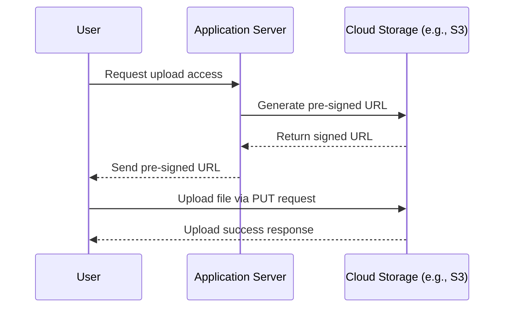

# Pre-Signed URLs for Secure File Uploads

## Overview

* **Pre-signed URL**: A **temporary URL** that grants access to a resource (e.g., file upload/download) without
  requiring authentication.
* Commonly used in **cloud storage** services (e.g., **Amazon S3**, **Google Cloud Storage**) to allow secure file
  sharing or uploads.
* Useful when a system needs to let users interact with files **without exposing credentials**.

---

## Key Concepts

* **Temporary access**: URL is valid only for a limited time (e.g., a few minutes).
* **Operations supported**: Upload (PUT), Download (GET), Delete.
* **Signature mechanism**: The URL contains a **signature** (hash of the request + secret key) that verifies
  authenticity.
* **No direct authentication**: User does not need login credentials.

---

## Upload Workflow (YouTube Example)

1. **Request URL**:

    * User asks the server (e.g., YouTube backend) for a **pre-signed URL**.

2. **Generate URL**:

    * Server generates a pre-signed URL with the **HTTP method = PUT**.
    * The URL includes:

        * Validity period (expiration time).
        * Signature.
        * File details (location, format).

3. **Upload file**:

    * User uploads the video using the **HTTP PUT request** with the pre-signed URL.

4. **Server validation**:

    * Server verifies the signature and expiry time.
    * If valid → file is stored.
    * If invalid/expired → request is rejected.

5. **Response**:

    * Server confirms successful upload.
    * May include metadata: file size, format, storage location.

---

## Diagram: Pre-Signed URL Upload Flow

---

## Security Mechanism

* Pre-signed URL = `Base URL + Expiry + Signature`.
* **Signature**: Generated using **secret access key** + request details.
* On upload:

    * Storage service recomputes signature.
    * If valid and not expired → action allowed.
    * Else → **error** returned.

---

## Alternatives to Pre-Signed URLs

* **SFTP (Secure File Transfer Protocol)**:

    * Encrypted + authenticated file transfer.
    * Requires credentials, not as lightweight as pre-signed URLs.

* **RBAC (Role-Based Access Control)**:

    * Access restricted based on user roles/permissions.
    * Useful for **fine-grained access control** to files/directories.

---

## System Design Interview Relevance

* Demonstrates ability to design for **secure media uploads/downloads**.
* Key considerations:

    * **Scalability**: Handles large files (e.g., videos).
    * **Security**: Protects against unauthorized access.
    * **Trade-offs**: Pre-signed URLs vs. SFTP vs. RBAC.
* Understanding this pattern shows **awareness of secure data handling** in distributed systems.

---

✅ **Key Takeaways**

* **Pre-signed URLs** enable secure, time-limited access to resources without exposing credentials.
* Widely used in **video uploads, file sharing, and cloud storage operations**.
* Important to know in **system design interviews**, especially for scenarios involving **large media files**.

---

Do you want me to also add **pros and cons of pre-signed URLs** (compared to alternatives like SFTP and RBAC) so you
have a crisp comparison table for interviews?
