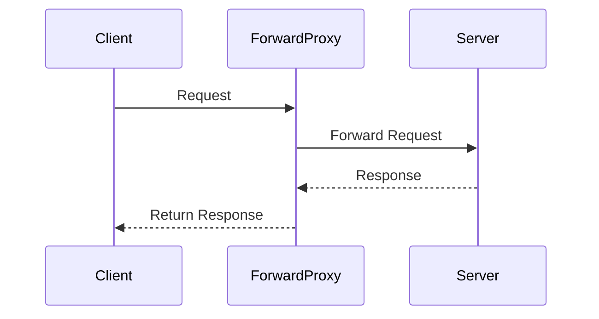
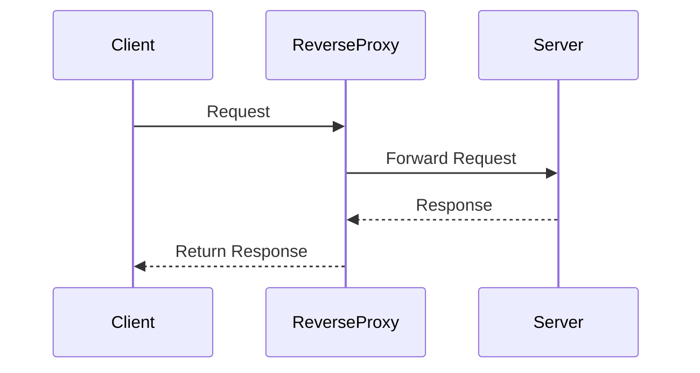
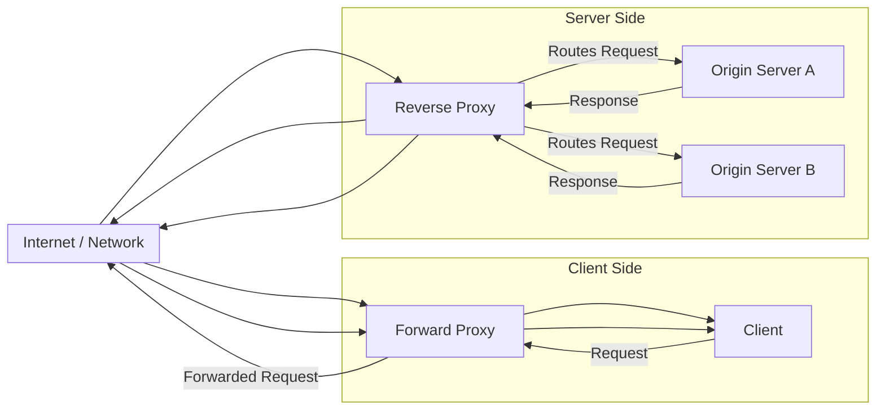

# Proxy Servers in System Design

## Overview

* A **proxy** is a server that sits between **clients** and **servers**.
* Two main types:

    * **Forward Proxy** – acts on behalf of clients.
    * **Reverse Proxy (Gateway)** – acts on behalf of servers.

---

## Forward Proxy

* **Definition**: A proxy server configured on the **client side**. It forwards client requests to the server.
* **Workflow**:

    1. Client → Forward Proxy → Origin Server.
    2. Origin Server → Forward Proxy → Client.
* **Key Characteristics**:

    * Server only sees the **forward proxy** as the requester.
    * Client’s **identity and location** are hidden.
* **Use Cases**:

    * **Bypassing restrictions**: Example – VPN to access geo-blocked content.
    * **Anonymity**: Conceals the real client from the server.
    * **Firewall evasion**: Helps clients bypass local or network firewalls.

### Diagram

---

## Reverse Proxy (Gateway)

* **Definition**: A proxy server configured on the **server side**. Appears to clients as the destination server.
* **Workflow**:

    1. Client → Reverse Proxy (appears as server).
    2. Reverse Proxy → Actual Server.
    3. Actual Server → Reverse Proxy → Client.
* **Key Characteristics**:

    * Client is **unaware** of the reverse proxy.
    * Provides a **single point of entry** for requests.
* **Use Cases**:

    * **Security**: Hides the details of origin servers from clients.
    * **Load Balancing**: Distributes requests among multiple servers.
    * **Filtering**: Blocks unwanted or malicious requests.
    * **Logging & Metrics**: Captures request data for monitoring.
    * **Caching**: Serves static assets (images, CSS, HTML) efficiently.

### Diagram

---

## Comparison

| Feature            | Forward Proxy                         | Reverse Proxy                                |
|--------------------|---------------------------------------|----------------------------------------------|
| **Location**       | Client-side                           | Server-side                                  |
| **Who is hidden?** | Client identity is hidden from server | Server details are hidden from client        |
| **Awareness**      | Server doesn’t know about proxy       | Client doesn’t know about proxy              |
| **Main Uses**      | Anonymity, bypass restrictions, VPN   | Security, load balancing, caching, filtering |

---

## Key Takeaways

* **Forward Proxy**: Client → Proxy → Server.

    * Helps clients **conceal identity** and **bypass restrictions**.
* **Reverse Proxy**: Client → Proxy (appears as server) → Server.

    * Helps servers **improve security, scalability, and efficiency**.

---

Do you want me to also create a **combined architecture diagram** (showing both forward and reverse proxies in one flow)
for better visual comparison?

