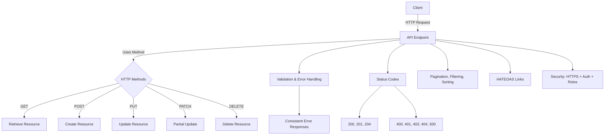

# REST API Best Practices (with Java/Spring Examples)

## 1. HTTP Methods – Correct Usage

* **GET** → Retrieve data. Must be **idempotent** (multiple requests = same effect).
* **POST** → Create a new resource. **Not idempotent**.
* **PUT** → Update an existing resource **entirely**. Always **idempotent**.
* **PATCH** → Partially update a resource. **Not idempotent**.
* **DELETE** → Delete a resource. Always **idempotent**.

👉 Think of **HTTP methods as verbs** and use them consistently.

---

## 2. Resource Design – Nouns & Hierarchical URIs

* Use **nouns** in URIs, not verbs.
* Example (✅ Good):

    * `GET /customers` → Retrieve customers
    * `POST /customers` → Create a new customer
    * `DELETE /customers/{id}` → Delete customer
* Example (❌ Bad): `/getCustomers`, `/createUser`
* Use **hierarchical URIs** for nested resources:

    * `/customers/123/orders` → Orders for customer 123

---

## 3. HTTP Status Codes

* **200 OK** → Success
* **201 Created** → New resource created
* **204 No Content** → Success but no data to return
* **400 Bad Request** → Invalid input
* **401 Unauthorized** → Authentication required
* **403 Forbidden** → Authenticated but no permission
* **404 Not Found** → Resource not found
* **500 Internal Server Error** → Server-side error

---

## 4. Error Handling

* Use **clear, descriptive, consistent error messages**.
* In Spring, use `@RestControllerAdvice` to handle exceptions globally.
* Example: Return structured error response instead of cryptic message:

  ```json
  {
    "error": "Resource Not Found",
    "status": 404,
    "message": "Customer with ID 123 not found"
  }
  ```
* Helps clients debug and fix issues quickly.

---

## 5. Validation

* Use **Hibernate Validator** or similar frameworks.
* Example in Spring:

    * `@Valid` + `@RequestBody` ensures request data is valid.
    * Returns **400 Bad Request** with details if validation fails.
* Keeps APIs clean and prevents bad data from entering the system.

---

## 6. API Versioning

Two approaches:

1. **URI Versioning (Simple)**

    * `/v1/customers`, `/v2/customers`
    * Separate controllers for each version.
2. **Header Versioning (Flexible)**

    * Use custom header: `Accept-Version: v1`
    * Same URI but differentiated by version header.

---

## 7. Pagination, Filtering & Sorting

* **Pagination** → Break results into pages (`page`, `size` params).
* **Filtering** → Narrow down results using query params (`?name=John`).
* **Sorting** → Order results (`?sortBy=createdDate`).

Spring Data JPA supports these with `Pageable` and `Sort`.

---

## 8. HATEOAS (Hypermedia as the Engine of Application State)

* Enhance API discoverability by embedding **links** in responses.
* Example (Spring HATEOAS):

  ```json
  {
    "id": 1,
    "title": "Spring Boot Guide",
    "_links": {
      "self": { "href": "/books/1" },
      "all-books": { "href": "/books" }
    }
  }
  ```
* Guides clients on **next possible actions**.

---

## 9. Security

* Always use **HTTPS** for encryption.
* Implement **Authentication** (OAuth2, JWT).
* Implement **Authorization** (who can access what).
* Use **Spring Security** for role-based access control.

---

## Visual Overview



---

## 🔑 Key Takeaways

* Use **HTTP methods correctly** (respect idempotency).
* URIs should use **nouns + hierarchy**, not actions.
* Return **meaningful status codes** and structured errors.
* **Validate input** at the boundary.
* Support **versioning** to avoid breaking old clients.
* Provide **pagination, filtering, sorting** for large datasets.
* Add **HATEOAS links** for discoverability.
* Secure APIs with **HTTPS, authentication, authorization**.

---

Do you want me to also make a **concise 1-page cheat sheet** from this (just keywords + examples) for quick
pre-interview revision?
