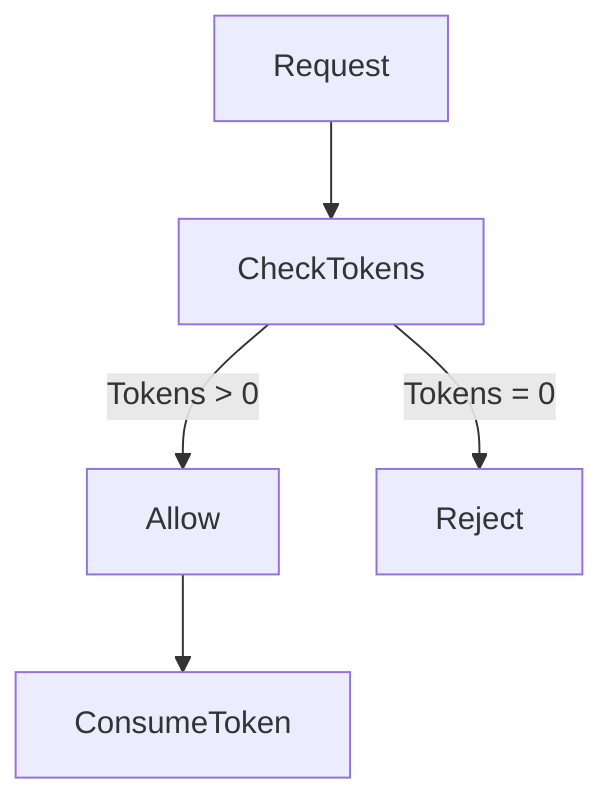
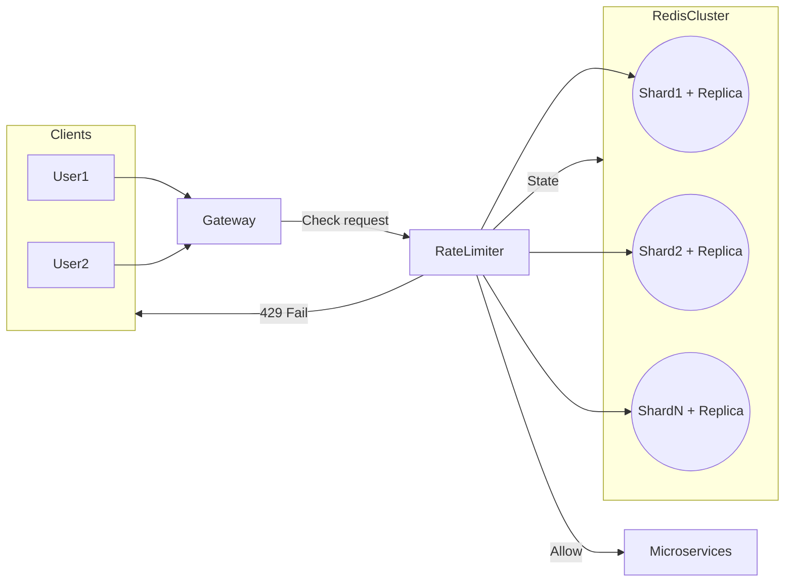

# System Design Notes: **Rate Limiter**

[](https://www.youtube.com/watch?v=MIJFyUPG4Z4)

## What is a Rate Limiter?

* **Definition**: Controls how many requests a client can make within a specific time frame.
* **Purpose**: Protects backend services from abuse (e.g., spam requests that could degrade availability).
* **Example**: Limit users to **100 requests per minute per user** in a social media app.

---

## System Design Framework (Hello Interview)

1. **Requirements**

    * Functional: What the system must do.
    * Non-functional: How the system must behave (qualities).
2. **Entities**: Nouns of the system (requests, users, rules).
3. **Interface**: Define how other components interact with this service.
4. **High-Level Design**: Boxes and arrows for a minimal working solution.
5. **Deep Dives**: Scale, latency, fault tolerance, and advanced requirements.

---

## Requirements

### Functional

1. **Identify clients**

    * By **user ID**, **IP address**, or **API key**.
2. **Limit requests**

    * Based on **configurable rules** (e.g., per endpoint, per user type).
3. **Return errors clearly**

    * **429 Too Many Requests** with helpful headers (remaining quota, reset time).

### Non-Functional

1. **Scalability**: Handle **1M requests/sec**, **100M DAUs**.
2. **Low latency**: Add **<10ms overhead** per request.
3. **Availability > Consistency** (CAP theorem).

    * System should **keep working** even if rules are slightly outdated.
4. **Fault tolerance**: Must survive node failures.
5. **Security**: Rules must prevent abuse, clients cannot bypass.

---

## Core Entities

* **Request** – incoming user action.
* **Client** – identity of user (IP, ID, API key).
* **Rule** – defines allowed requests (e.g., 100/min).

---

## Interface

Function call (system-level, not user API):

```text
isRequestAllowed(clientId, rule) → {allowed: true/false, metadata}
```

* **Metadata**: Remaining requests, reset time.

---

## High-Level Design

### Placement Options

1. **Inside each microservice**

    * ✅ Fast (local memory).
    * ❌ No global coordination (user could bypass across services).

2. **As a separate service**

    * ✅ Global coordination.
    * ❌ Extra network hop increases latency.

3. **At the API gateway (chosen)**

    * ✅ Stops bad traffic early ("bouncer at the club").
    * ✅ Global view of client requests.
    * ❌ Limited context (needs JWT or headers to identify premium users).

```mermaid
flowchart LR
    Client --> Gateway
    Gateway --> RateLimiter
    RateLimiter -->|Pass| Microservices
    RateLimiter -->|Fail ( 429 )|Client
```

### Client Identification

* **Options**: User ID, IP, API key.
* **Best practice**: Combination (layered rules: e.g., user-specific + IP-based + API quota).

---

## Rate Limiting Algorithms

1. **Fixed Window Counter**

    * Count requests in each interval.
    * ✅ Simple.
    * ❌ Boundary effect (burst at window edges).

2. **Sliding Window Log**

    * Track exact timestamps in a rolling window.
    * ✅ Accurate.
    * ❌ High memory (store logs).

3. **Sliding Window Counter**

    * Approximate rolling window with two counters.
    * ✅ Low memory.
    * ❌ Less accurate (assumes even distribution).

4. **Token Bucket (chosen)**

    * Each client has a bucket:

        * **Bucket size** = burst capacity.
        * **Refill rate** = sustained rate.
    * ✅ Handles bursts + steady traffic.
    * ✅ Simple implementation (track tokens + last refill timestamp).



---

## Implementation (Token Bucket + Redis)

1. **Request comes in**.
2. **Gateway fetches state** from Redis (`hmget tokens, last_refill`).
3. **Recalculate tokens** based on elapsed time + refill rate.
4. **Decision**: Allow if tokens > 0, else reject.
5. **Update Redis** with new token count & last refill.

**Concurrency issue**: Multiple gateways could read/write at once → race condition.

* ✅ Solution: Use **Redis Lua scripts** for atomic read-update-write.

---

## Response on Limit Breach

* **HTTP 429 Too Many Requests**.
* Common headers:

    * `X-RateLimit-Limit`: max allowed.
    * `X-RateLimit-Remaining`: remaining quota.
    * `X-RateLimit-Reset`: when limit resets.
    * `Retry-After`: time to wait before retry.
* **Fail Fast** strategy: Reject immediately (no queueing).

---

## Deep Dives (Non-Functional)

### Scalability

* Single Redis = bottleneck (\~100k ops/sec).
* Need **20+ Redis shards** for 1M RPS.
* Use **Redis Cluster**:

    * Distributes client buckets across shards via **hash slots**.

### High Availability

* Redis shard failure = lost state.
* Options:

    * **Fail Open**: allow all → backend may crash.
    * **Fail Close**: block all → app unusable.
    * ✅ Better: **Replicas + async replication** → failover to replica.
    * Gateways can temporarily fallback to **fixed window counter in memory**.

### Low Latency

* Redis ops <1ms, but network adds delay.
* ✅ **Connection pooling** (avoid TCP handshake).
* ✅ **Colocate gateway + Redis** in same region/DC.
* ✅ **Geo-distribution**: place gateways close to users.

### Dynamic Rules

* Static rules (hardcoded) = simple but inflexible.
* Options:

    1. Poll DB/Redis for updates (adds latency).
    2. Push-based configs via **etcd/Zookeeper**.

        * Gateways load rules into memory.
        * Subscribe to updates → rules change dynamically.

---

## Final Architecture



---

✅ **Covered**:

* Functional requirements.
* Token Bucket algorithm.
* Redis-based scalable implementation.
* Latency + HA optimizations.
* Rule configuration management.

---

Do you want me to also add a **comparison table of the four algorithms** (pros, cons, use cases) so you can quickly
revise before interviews?

## Algorithm Comparison — **Rate Limiting**

| **Algorithm**               | **How it works (summary)**                                                                                                        | **Pros**                                                                                         | **Cons**                                                                                 | **Burst Handling**                                       | **Memory per Client**                   | **Accuracy**                                 | **When to use**                                                                              |
|-----------------------------|-----------------------------------------------------------------------------------------------------------------------------------|--------------------------------------------------------------------------------------------------|------------------------------------------------------------------------------------------|----------------------------------------------------------|-----------------------------------------|----------------------------------------------|----------------------------------------------------------------------------------------------|
| **Fixed Window Counter**    | Count requests in a fixed interval (e.g., minute); reset counter at window boundary.                                              | **Trivial to implement**; constant-time checks; tiny state.                                      | **Boundary effect** (can spike across edges); **starvation** right after limit.          | Poor at smoothing; can allow large bursts at boundaries. | **Very low** (counter + window start).  | **Low** near boundaries.                     | Simple systems; rough protection where bursts are acceptable.                                |
| **Sliding Window Log**      | Track **exact timestamps** of recent requests in a rolling window; allow if count < limit.                                        | **Most accurate**; eliminates boundary effect.                                                   | **High memory** (store timestamps); more compute (heap/deque ops).                       | Good (precise smoothing).                                | **High** (stores recent request times). | **High** (exact).                            | Strict accuracy requirements and lower scale.                                                |
| **Sliding Window Counter**  | Keep **two counters** (previous + current fixed windows) and **weight** previous by elapsed fraction.                             | **Low memory**; **better smoothing** than fixed window.                                          | **Approximation**; assumes near-even distribution within windows.                        | Moderate; smoother than fixed window.                    | **Very low** (two integers).            | **Medium** (approximate).                    | Large-scale systems needing balance of cost & smoothness.                                    |
| **Token Bucket** *(chosen)* | Each client has **bucket size** (burst capacity) and **refill rate** (steady rate). Consume 1 token per request; reject if empty. | **Handles bursts + steady rate**; simple state (**tokens + last refill**); easy to reason about. | Requires tuning **bucket size** & **refill rate**; needs atomic updates in shared store. | **Excellent** (explicit burst capacity).                 | **Very low** (two numbers).             | **High** for target behavior (burst + rate). | Most production systems (gateways, APIs) aiming for controlled bursts and steady throughput. |

### Quick Takeaways

* If you need **accuracy** above all else → **Sliding Window Log**.
* If you need **simplicity** and can tolerate edge bursts → **Fixed Window**.
* If you want **low memory** with **some smoothing** → **Sliding Window Counter**.
* If you want **production-friendly** control of **bursts** and **steady rate** with tiny state → **Token Bucket** (plus
  atomic updates, e.g., **Redis + Lua**).

