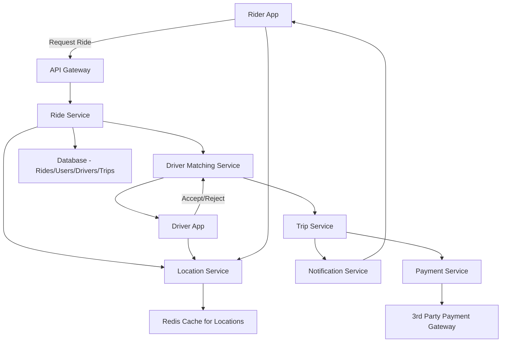

Got it 👍 Let’s design a **service like Uber** at a high level.

---

# HLD – Uber-like Service

A ride-hailing platform connecting drivers with riders in real-time.

---

### Functional Requirements

1. Rider can request a ride from point A → B.
2. Driver can accept/reject ride requests.
3. Real-time tracking of driver location and trip.
4. Fare calculation (distance, surge pricing, base fare).
5. Payment integration (cash, card, wallet).
6. Rating system for drivers and riders.
7. Trip history for both riders and drivers.

---

### Non Functional Requirements

1. **Scalability** – Handle millions of concurrent requests.
2. **Low latency** – Match drivers to riders within seconds.
3. **Availability** – 99.99% uptime (no downtime in peak hours).
4. **Reliability** – No double-booking of drivers.
5. **Security** – Protect payment and personal info.
6. **Fault tolerance** – System should degrade gracefully.

---

### Assumptions Taken

* GPS availability on all devices.
* Payments handled via third-party providers.
* System must work across cities/countries.
* Drivers are verified and registered in the system.

---

### System Limitations

* Surge pricing depends on demand/supply but may cause dissatisfaction.
* Network latency affects location accuracy.
* Driver cancellations cannot be fully eliminated.

---

### Entities

1. **User (Rider)** – riderId, name, phone, rating, payment methods.
2. **Driver** – driverId, name, vehicle details, license, availability, rating.
3. **Ride Request** – rideId, riderId, pickupLocation, dropLocation, status.
4. **Trip** – tripId, driverId, riderId, route, fare, timestamps.
5. **Payment** – paymentId, tripId, riderId, amount, method, status.

---

### High level design diagram

---

### Throughput and Latency Calculations

* Assume **1M daily active users** → \~10 rides/sec average, **1000 rides/sec peak**.
* Each ride requires \~5–10 API calls (match, location updates, trip start/end, payment).
* **Peak QPS** ≈ 10,000 API calls/sec.
* **Latency goal**: < 200ms for driver match, < 1s for payment confirmation.

---

### APIs

* **Rider APIs (REST/gRPC)**

    * `POST /ride/request` (create ride request)
    * `GET /ride/{rideId}/status`
    * `POST /payment/{tripId}`
* **Driver APIs (WebSocket/gRPC)**

    * `GET /ride/available` (streaming for nearby requests)
    * `POST /ride/{rideId}/accept`
    * `POST /ride/{rideId}/complete`
* **Location APIs (WebSocket)**

    * `POST /driver/{id}/location`
    * `POST /rider/{id}/location`

---

### Data Flow

#### API 1: `POST /ride/request`

1. Rider sends pickup & drop location.
2. Ride Service validates request.
3. Calls Driver Matching Service with pickup location.
4. Matching Service queries Location Service → finds nearest available drivers.
5. Sends ride offer to selected driver(s).
6. On driver acceptance → Trip Service creates trip record.
7. Notification Service informs rider of driver details.

#### API 2: `POST /ride/{rideId}/complete`

1. Driver marks trip as complete.
2. Trip Service calculates fare.
3. Payment Service initiates transaction.
4. Payment Gateway confirms → updates DB.
5. Rider & driver notified.
6. Ratings API enabled for feedback.

---

Do you want me to **extend this HLD to cover advanced Uber features** (like Surge Pricing Engine, ETA prediction, Shared
Rides/Pooling), or keep it strictly at MVP level?
