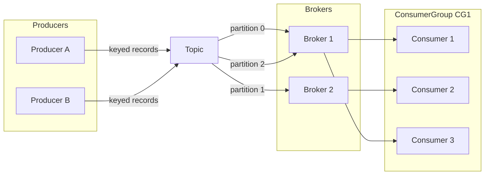
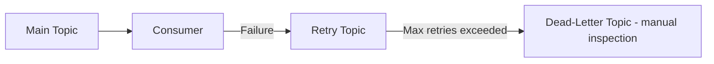
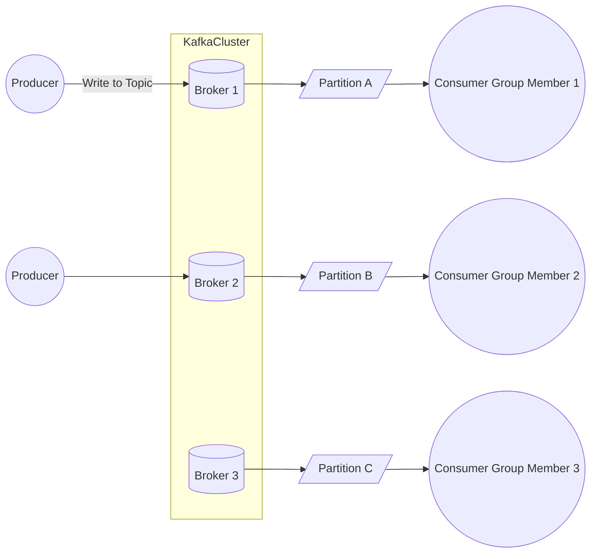
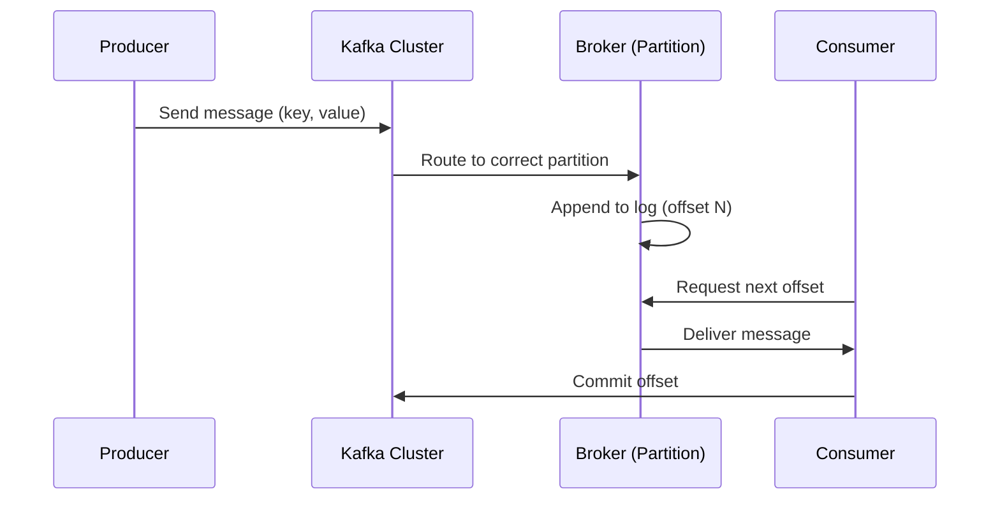
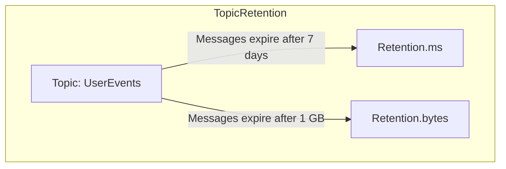

# Event Streaming with **CFA / Kafka** — System Design Interview Notes

> Senior-level revision notes based on the transcript. Focus on *when/why to use CFA (Kafka)*, core concepts,
> trade-offs, and deep-dive topics.

## Big Picture

* **What it is:** **CFA** (used interchangeably with **Kafka** in the talk) is a distributed **event streaming**
  platform that can act as a **message queue** and a **stream-processing backbone**.
* **Why it matters:** Ubiquitous in large-scale systems (used by many Fortune 100). Common in interviews for decoupling
  services, real-time analytics, back-pressure control, and ordered processing.
* **Interview stance:** Be able to (1) identify **when** to introduce CFA, (2) explain **core primitives**, and (3) go
  deep on **scalability, fault tolerance, retries, performance, and retention**.

---

## Core Concepts & Terminology

* **Broker**: A **server** (physical/virtual) that stores data and serves reads/writes. Clusters comprise multiple
  brokers.
* **Partition**: An **ordered, immutable append-only log** on disk. Scaling and parallelism happen via partitions.
* **Topic**: A **logical grouping** of partitions (n ≥ 1). You **produce to** and **consume from** topics.

  * **Topic vs Partition**: *Topic* = logical label; *Partition* = physical log file. Topics organize; partitions scale.
* **Producer**: Writes **messages/records** to a topic.
* **Consumer**: Reads messages from a topic.
* **Consumer Group**: A set of consumers where **each message is processed by exactly one consumer in the group** (
  parallelism without duplication).
* **Message/Record**: **Key**, **Value**, **Timestamp** (ordering), **Headers** (metadata KV pairs).
* **Partition Key** (**Key**): Determines which partition a message goes to (via **hash + modulo**). **Choosing this
  well is central to ordering and scale.**
* **Offset**: Per-partition, monotonically increasing index. Consumers track and **commit** the latest processed offset.
* **Leader / Followers**: Each partition has one **leader** (handles reads/writes) and **followers** (replicate, can
  take over on failure).
* **Cluster Controller**: Coordinates leader assignment and tracks partition→broker mappings.

---

## Motivating Example (Ordering & Scale)

* Live sports updates: with many concurrent games, **horizontal scaling** requires **partitioning** by a game identifier
  to preserve **per-game order** while allowing parallelism across games.
* **Key insight**: You can’t guarantee global order, but you **can** guarantee **per-key** order (e.g., *all events for
  Brazil-Argentina*).

---

## Lifecycle (Under the Hood)

1. **Produce**: App sets the **key** (partition key) and message **value** (payload).
2. **Route**: Cluster **hashes key** → `hash(key) % numPartitions` → selects partition; controller maps to a **broker**.
3. **Append**: Broker **appends** to the partition log (offset assigned).
4. **Consume**: Consumer reads from the **next offset**, processes work, and **commits offset** (periodically and/or
   after unit of work).
5. **Recover**: On restart or failover, consumer **resumes** from last committed offset; **consumer groups** rebalance
   partition assignments.

---

## When to Use CFA in an Interview

* **Asynchronous processing**: e.g., video **transcoding** pipeline. Put **small messages** with **pointers** (e.g., S3
  URL), not massive blobs.
* **Ordered processing per key**: e.g., **ticketing wait queues** that admit users in batches while preserving order per
  event.
* **Decoupling & independent scaling**: **burst-heavy producers** decoupled from **costly/slow consumers** (e.g.,
  code-execution workers).
* **Streams / real-time analytics**: **Ad-click aggregation**; compute rolling metrics with stream processors (e.g., *
  *Flink**) reading CFA.
* **Pub/Sub fan-out**: Same stream consumed by **multiple, independent services** (e.g., real-time comments to all
  subscribed viewers).

---

## Diagram — High-Level Architecture

---

## Deep Dives & Trade-offs (What Interviewers Probe)

### 1) Scalability

* **Message size guidance**: Keep **< \~1 MB**. Anti-pattern: putting the **media blob** on CFA; instead store in **S3**
  and send **{videoId, S3 URL}**.
* **Broker ballpark** (rule-of-thumb from talk): \~**1 TB** storage, \~**10k msgs/s** per well-provisioned broker (
  varies widely with hardware and payloads).
* **Scale out**:

  * Add **more brokers** (capacity).
  * **Increase partitions** and **choose a good partition key** to distribute evenly and maximize parallelism.
* **Hot partitions** (e.g., a viral ad ID):

  * **Remove key** (random/round-robin) if ordering isn’t required.
  * **Compound keys** (e.g., `adId:shard` where `shard ∈ [1..N]`, or add **userId**/**prefix**).
  * **Back-pressure** from producers if feasible.
* **Managed services**: **Confluent Cloud**, **AWS MSK** reduce operational toil (still need to pick keys/partitions
  thoughtfully).

### 2) Fault Tolerance & Durability

* **Replication**: **Leader + followers** per partition; followers replicate and can take over.
* **Key configs**:

  * **`acks=all`** → wait for **all replicas** to acknowledge (**max durability**, **higher latency**).
  * **Replication factor** (often **3** by default): raise for higher durability (at storage cost).
* **“What if CFA goes down?”**: With replication and failover, **cluster-wide outage is unlikely**; a more realistic
  focus is **consumer failure & rebalancing**.
* **Offset commit timing**:

  * **Commit *after* completing the unit of work** (e.g., only after persisting fetched HTML to S3 in a web crawler) to
    avoid message loss.

### 3) Errors & Retries

* **Producer retries**:

  * Configure **retry count** and **backoff**; enable **idempotent producer** to avoid duplicates on retry.
* **Consumer retries** (CFA doesn’t provide built-in):

  * Adopt **retry topics** (+ retry count in headers) and ultimately a **Dead-Letter Queue (DLQ)** topic after N
    failures.
  * Note: Some managed queues (e.g., **AWS SQS**) support consumer retries/DLQs natively—useful comparison in
    interviews.

#### Diagram — Consumer Retry & DLQ Pattern

### 4) Performance Optimizations (Throughput/Latency)

* **Batching** (producer): send messages in **batches** (max batch size and linger time) → fewer requests, higher
  throughput.
* **Compression** (producer): **gzip** (or other) on payloads → fewer bytes over the wire.
* **Partition strategy first**: The **biggest lever** is an **even key distribution** across partitions/brokers.

### 5) Retention Policies (Cost vs Reprocessing Needs)

* **Per-topic** settings:

  * **`retention.ms`** (default ≈ **7 days** in the talk) — time-based purge of old log segments.
  * **`retention.bytes`** (default ≈ **1 GB** in the talk) — size-based purge.
* **Whichever triggers first** purges oldest segments. Extend for replay requirements, but call out **storage cost** and
  **I/O impact**.

---

## Patterns & Best Practices (Interview-friendly Sound Bites)

* **Decouple** using topics; **scale** via partitions; **preserve order per key**.
* **Pick keys carefully** (domain-aware): e.g., gameId, userId, orderId; mitigate hotspots with **sharding**.
* **Keep messages small**; store **large blobs** out-of-band (e.g., S3) and reference them.
* **Commit offsets after side-effects** complete (exactly-once per consumer group).
* **Plan for retries**: producer configs + **retry topic → DLQ**.
* **Tune for throughput**: batching + compression; verify that **consumers** keep up (or add more in the group).
* **Use managed Kafka** when ops time is constrained; still justify **partitioning** and **retention** choices.

---

## Example Use Cases You Can Name-Drop

* **Video pipeline**: Upload → enqueue `{videoId, s3Url}` → **transcoders** consume and write variants.
* **High-demand ticketing**: Enqueue users; **batched releases** off a queue to reduce contention.
* **Online judge / coding contests**: **Spike-tolerant** submission ingestion; worker pool consumes at steady rate.
* **Ad click aggregation (stream)**: Continuous counts per ad; downstream dashboards/alerts.
* **Pub/Sub for live features**: Live comments fan-out to all subscribed viewers/services.

---

## Quick Glossary (Bolded Keywords)

* **Broker**: Kafka/CFA server storing partitions and serving traffic.
* **Topic**: Logical stream label grouping partitions.
* **Partition**: Append-only **log**; unit of parallelism and ordering.
* **Producer / Consumer**: Writers/readers of records to/from topics.
* **Consumer Group**: Ensures **exactly-once within group** (no duplicate processing in group).
* **Key (Partition Key)**: Field used to **hash** and route to a partition; preserves **per-key order**.
* **Offset**: Monotonic index in a partition; consumers **commit** progress.
* **Leader / Follower**: Primary replica vs. replicas for **durability** and **failover**.
* **`acks`**: Producer durability setting (e.g., **`acks=all`**).
* **Replication Factor**: Number of replicas per partition (commonly **3**).
* **Back-pressure**: Slowing producers when consumers/partitions are overloaded.
* **DLQ (Dead-Letter Queue)**: Terminal topic for **permanent failures** after retries.
* **Retention**: **Time/size** rules (e.g., **`retention.ms`**, **`retention.bytes`**) for log cleanup.
* **Batching / Compression**: Producer optimizations for **throughput**.
* **Managed Kafka**: **Confluent Cloud / AWS MSK** (ops offload).

---

## Open Questions to Clarify in Interviews (if relevant)

* Required **ordering** scope? (global vs **per key**).
* **Replay** horizon? (drives **retention** and storage).
* **Throughput/latency** SLOs? (guides batching, compression, partition counts).
* Failure semantics: **at-least-once** acceptable, or stronger? (**offset commit timing**, idempotency).
* Expected **hot keys**? (plan **sharding** scheme and monitoring).

---

*With these points, you can confidently introduce CFA/Kafka, justify it, and dive deep on the trade-offs interviewers
care about.*

Got it ✅ — here are the **system design interview prep notes on Kafka (CFA)** with only **GitHub-compatible Mermaid
diagrams** included.

---

# Kafka (CFA) – System Design Interview Notes

## What is Kafka (CFA)?

* **Distributed event streaming platform**
* Can function as:

  * **Message queue** (asynchronous decoupling, buffering)
  * **Stream processing system** (real-time analytics, pub/sub)
* Used by **80% of Fortune 100 companies**
* Common in **system design interviews** → demonstrates knowledge of scalability, fault tolerance, and event-driven
  design

---

## Motivating Example: World Cup Event Updates

* **Producer**: Records events (goal, substitution, card) → sends to Kafka
* **Consumer**: Reads from Kafka → updates website
* Challenges as scale increases:

  1. **Too many events** → solution: **horizontal scaling** (more brokers/partitions)
  2. **Ordering issues** → solution: **partition by key** (e.g., game ID)
  3. **Duplicate processing** → solution: **consumer groups**
  4. **Multiple domains (soccer vs basketball)** → solution: **topics**

---

## Core Kafka Concepts

* **Broker**: A Kafka server storing data (manages partitions)
* **Partition**: Append-only log file (ordered, immutable messages)
* **Topic**: Logical grouping of partitions (data organization)
* **Producer**: Writes messages to topics
* **Consumer**: Reads messages from topics
* **Consumer Group**: Ensures each message is processed by exactly one consumer in the group
* **Replication**: Leader/follower partitions ensure durability

---

---

## Message Lifecycle

1. **Producer creates message** → (key, value, timestamp, headers)
2. **Partitioning**:

* If key exists → hash(key) % numPartitions
* Else → round robin

3. **Broker lookup**: Controller maps partition → broker
4. **Append to log file** (offset-based, immutable)
5. **Consumer reads** message at next offset
6. **Offset committed** periodically to Kafka for fault recovery

---

---

## When to Use Kafka in Interviews

* **Asynchronous processing** → e.g., YouTube transcoding
* **Ordered processing** → e.g., TicketMaster wait queue
* **Decoupling producers/consumers** → independent scaling
* **Streaming analytics** → e.g., ad click aggregation
* **Pub/Sub** → e.g., chat or live comments

---

## Deep Dive Areas (Follow-Up Topics)

### 1. Scalability

* Add **more brokers** (storage + throughput)
* Use **partition keys** to balance load
* Avoid **hot partitions**:

  * Use **compound keys** (e.g., `adId:userId`)
  * Apply **backpressure** or random distribution
* Constraints:

  * Message size < **1MB** recommended
  * Broker ≈ **1TB storage, 10k msgs/sec**

---

### 2. Fault Tolerance & Durability

* **Replication factor** (default 3)
* **acks setting**:

  * `acks=all` → maximum durability
  * `acks=1` → faster but less safe
* **Leader/follower** → failover handled automatically
* **Offset commits** ensure recovery from consumer crashes

---

### 3. Errors & Retries

* **Producer retries**:

  * Configure retries + backoff
  * Use **idempotent producer** to avoid duplicates
* **Consumer retries**:

  * No built-in → use **retry topics** + **dead letter queues (DLQ)**

---

### 4. Performance Optimizations

* **Batching** → fewer requests, higher throughput
* **Compression** (gzip, snappy, lz4)
* **Partition strategy** → ensures parallelism
* **Consumer group scaling** → multiple consumers read in parallel

---

### 5. Retention Policies

* Configurable **per topic**:

  * `retention.ms` → default **7 days**
  * `retention.bytes` → default **1GB**
* Messages purged when either limit is reached
* Trade-off: storage cost vs replayability

---

---

## Key Interview Takeaways

* Always explain **partitioning strategy** (ordering + scaling trade-offs)
* Mention **consumer groups** for load balancing
* Cover **replication and durability** settings
* Bring up **retry and DLQ patterns** for reliability
* Show awareness of **managed Kafka services** (Confluent Cloud, AWS MSK)

---

Would you like me to also create a **condensed one-page cheat sheet version** of this (only keywords & diagrams, no long
explanations) for quick pre-interview revision?

