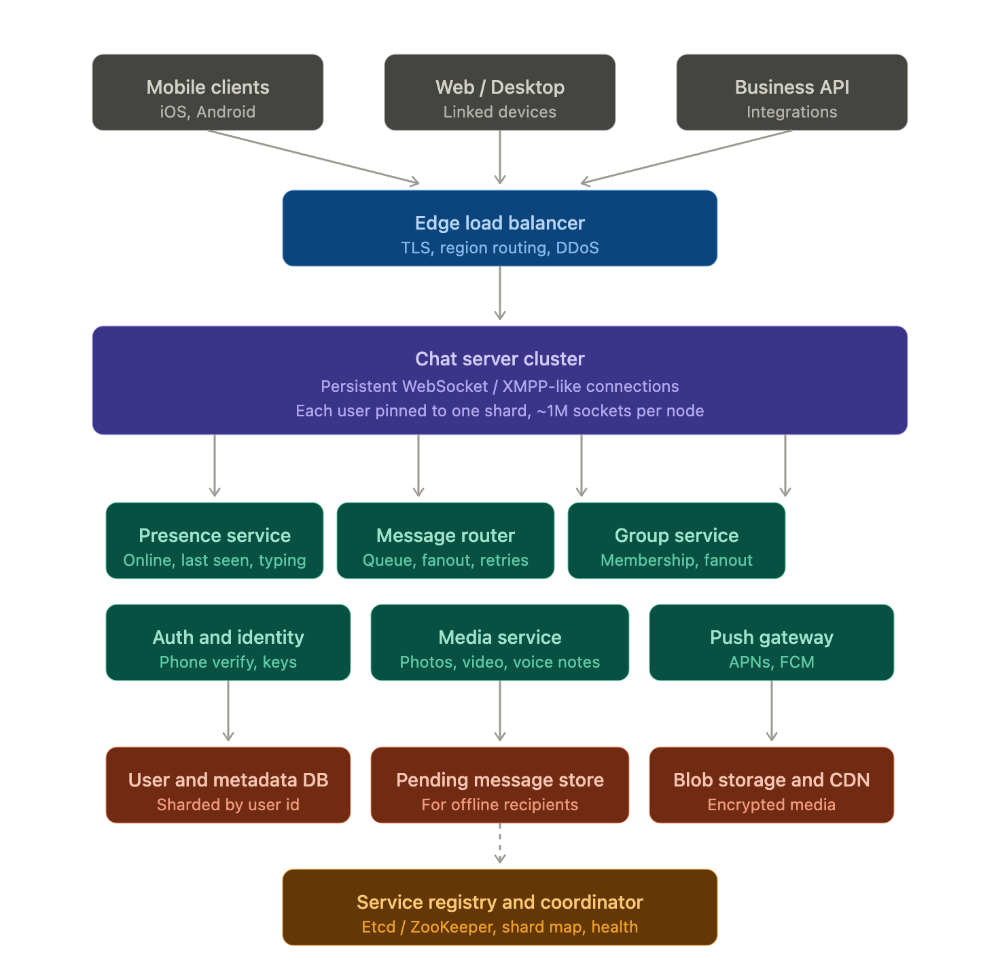
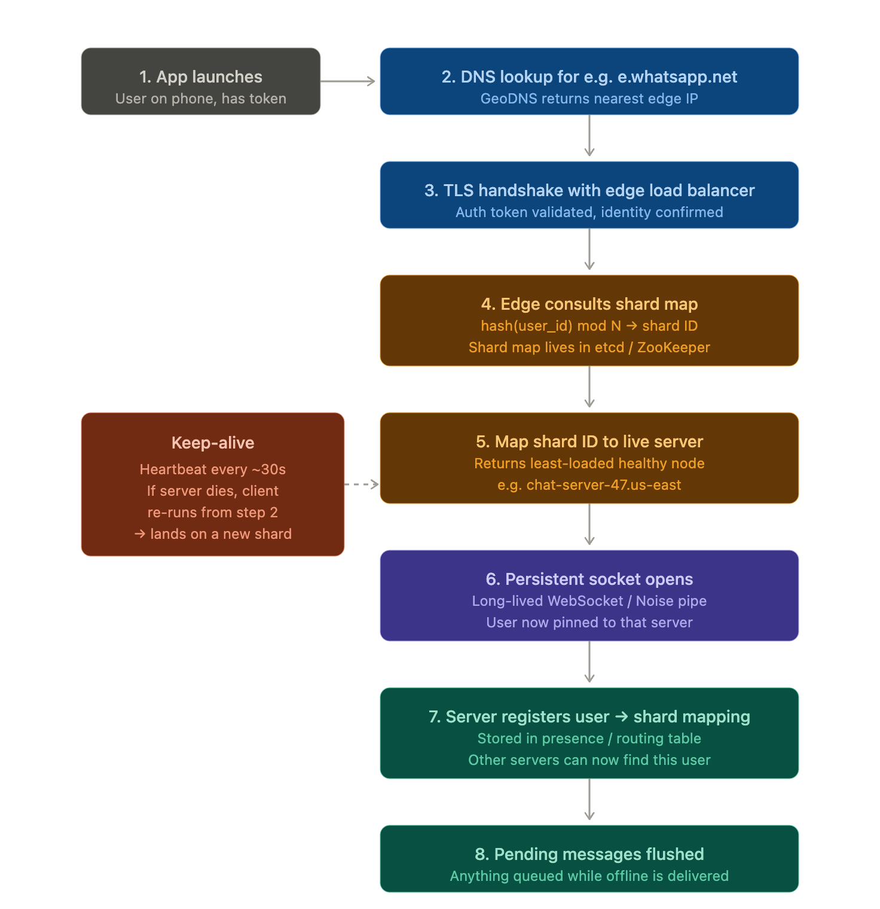

I'll create a high-level system design of WhatsApp with a focus on how users connect to specific servers. Let me load the diagram module first.Now I'll create the design. Let me start with the high-level architecture diagram.The architecture has five tiers. Clients keep a **persistent connection** (TLS over TCP, with a WebSocket-like binary protocol called Noise Pipes) open to a chat server — this is what makes "real-time" feel real-time. Messages flow in over that socket, get routed, and pop out on the recipient's socket within milliseconds.

A few key ideas worth calling out:

The chat server tier is the heart of the system. Each node holds roughly a million open sockets at once (this is famously what FreeBSD + Erlang let WhatsApp pull off with very few engineers). A user is **pinned** to one specific server while connected, so the system needs a way to know *which* server holds that user's socket at any given moment.

When you send a message, the chat server doesn't try to deliver it directly. It hands it to the **message router**, which looks up where the recipient is connected and forwards it. If the recipient is offline, the message goes to the **pending message store** and gets pushed via APNs/FCM as a wake-up signal.

Now the part you specifically asked about — how a user gets connected to a specific server.

The crucial step is **#4 and #5** — the shard mapping. There are two layers of indirection here, and that distinction is important:

**Layer 1 — which shard?** The user's ID gets hashed into a shard number using `hash(user_id) mod N`, or more commonly **consistent hashing** so that adding or removing servers doesn't reshuffle every user. This is purely deterministic — the same user always maps to the same shard, regardless of which physical machine is running it.

**Layer 2 — which physical server is running that shard?** This mapping lives in a coordination service like etcd or ZooKeeper and changes over time as servers crash, get replaced, or scale. The edge load balancer reads this to find a healthy machine.

This separation is what lets WhatsApp survive server failures gracefully. If `chat-server-47` dies, the coordinator detects it (heartbeats stop), reassigns shard 47 to a different physical node, and updates the map. The next time your phone reconnects (heartbeats fail within ~30 seconds), it gets routed to the new server. Your user identity → shard mapping never changed; only the physical home of that shard moved.

A few other details worth knowing:

The **routing table** in step 7 is what makes message delivery work. When Alice (on server A) sends a message to Bob, server A looks up Bob's current server (server B) in a fast in-memory routing table, then forwards the message directly over an internal RPC. If Bob is offline, no entry exists, so the message goes to the pending store and a push notification is fired.

For **multi-device** (your phone + WhatsApp Web + desktop), each device opens its own connection and is treated as a separate endpoint. They might land on completely different servers. The message router fans out to all of a user's active devices, and end-to-end encryption uses the Signal protocol's "sender keys" to handle this efficiently.

Want me to go deeper on any one piece — message delivery, end-to-end encryption, group chats at scale, or the media pipeline?